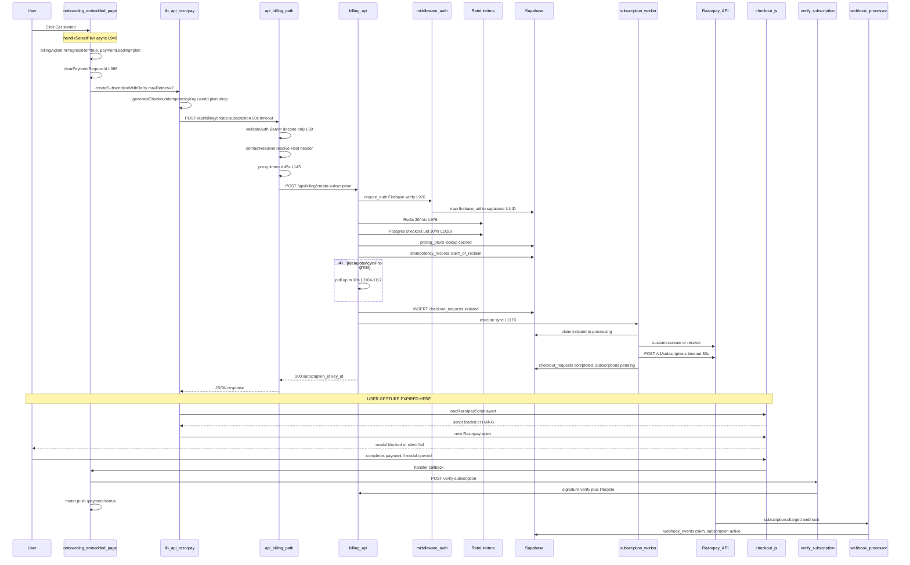
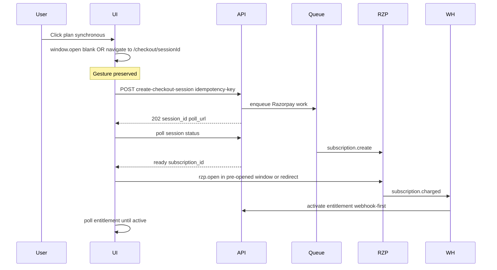

 ---
name: Payment Architecture Audit
overview: 'Complete forensic audit of the embedded-signup Razorpay flow. Root cause is proven: checkout opens only after long async chains (API + script load), breaking the browser user-gesture requirement. Secondary causes amplify failures into 429/504/500 and indefinite "Processing..." UI.'
todos:
  - id: p0-gesture-checkout
    content: "Implement gesture-safe checkout: SDK preload on pricing mount + sync open (blank window or redirect) — wire openRazorpayCheckoutSynchronous or navigation pattern in page.tsx"
    status: pending
  - id: p0-async-create
    content: Convert onboarding to async create-subscription (202 + poll checkout-status) — stop calling subscription_worker.execute synchronously in billing_api.py request thread
    status: pending
  - id: p0-fix-script-hang
    content: "Fix loadRazorpayScript() hang when #razorpay-sdk exists but load event already fired; add timeout + resetRazorpayScriptPromise on failure"
    status: pending
  - id: p0-disable-retries
    content: Set createSubscriptionWithRetry maxRetries=0 for onboarding until async path stable; adjust rate limit to not count idempotent replays
    status: pending
  - id: p0-idempotency-domain
    content: Pass currentDomain to generateCheckoutIdempotencyKey instead of hardcoded 'shop' in razorpay.ts createSubscription
    status: pending
  - id: p1-unify-paths
    content: Consolidate 4 checkout paths into single useBillingCheckout hook; remove duplicate handlers in onboarding-flow-client.tsx and client.tsx
    status: pending
  - id: p1-path-map-fix
    content: Fix Next.js PATH_MAP to proxy change-plan/cancel-change/verify-proration to /api/subscriptions/* endpoints
    status: pending
  - id: p2-observability
    content: Add checkout_open/checkout_create latency metrics, request_id correlation dashboards, alerts per docs/ALERTING_RULES.md
    status: pending
isProject: false
---

# Flowauxi Payment System — Complete Production Audit

**Investigation date:** 2026-06-28  
**Scope:** Full repository payment stack; P0 focus on [`frontend/app/onboarding-embedded/page.tsx`](frontend/app/onboarding-embedded/page.tsx)  
**Constraint:** No code changes until root causes are proven (this document satisfies that gate)

---

## 1. Executive Summary

The embedded onboarding payment flow is **not production-ready**. Razorpay Checkout fails to open reliably due to **multiple proven, interacting root causes** — not a single bug.

**Primary root cause (P0):** `rzp.open()` is invoked **outside the browser user-gesture window**. The click handler is `async`, awaits a backend call that can take **5–45+ seconds**, then awaits SDK script loading, then calls `openRazorpayCheckout()` → `razorpay.open()`. Modern browsers (especially Safari) block popups/modals opened from async continuations. The codebase already documents the fix (`openRazorpayCheckoutSynchronous`) but **the active onboarding page does not use it**, and even the sync helper cannot work if the SDK is not preloaded before the click.

**Secondary root causes (P0):**

- **Backend blocks the HTTP request** on Razorpay `subscription.create` (sync path in [`backend/routes/billing_api.py:1174-1195`](backend/routes/billing_api.py)) — documented as "300–800ms" but worker comments say **800–8000ms**, HTTP timeout is **30s read** ([`backend/routes/payments.py:877`](backend/routes/payments.py)).
- **Client auto-retry turns one click into 3 API calls** ([`frontend/lib/api/razorpay.ts:289-364`](frontend/lib/api/razorpay.ts) with `maxRetries=2` in [`page.tsx:999`](frontend/app/onboarding-embedded/page.tsx)), each incrementing **Redis (30/min) + Postgres (30/hr)** rate limit counters → **429 on a single user click**.
- **`loadRazorpayScript()` can hang forever** if a `#razorpay-sdk` tag exists but never fires `load`/`error` ([`frontend/lib/api/razorpay.ts:478-488`](frontend/lib/api/razorpay.ts)) → UI stuck on **"Processing..."** with no checkout and no error.
- **No SDK preload** on the active onboarding page (unlike [`PlanCard.tsx`](frontend/app/upgrade/components/PlanCard.tsx) and unused [`onboarding-flow-client.tsx:191`](frontend/app/onboarding-embedded/onboarding-flow-client.tsx)).

**Architecture verdict:** Four parallel checkout implementations, two backend patterns (sync vs async), fragmented circuit breakers, and a partially outdated internal audit doc ([`docs/payment-system-production-audit.md`](docs/payment-system-production-audit.md) still describes 202+polling for onboarding, but code now uses **sync** create-subscription).

---

## 2. Complete Payment Architecture

### 2.1 End-to-end sequence (embedded onboarding — **actual production path**)



### 2.2 Parallel checkout paths (fragmentation)

| Path                    | Entry                                                                     | Create API                              | Open pattern                 | Verify API                         |
| ----------------------- | ------------------------------------------------------------------------- | --------------------------------------- | ---------------------------- | ---------------------------------- |
| **Onboarding (active)** | [`page.tsx:949`](frontend/app/onboarding-embedded/page.tsx)               | sync `/api/billing/create-subscription` | async `openRazorpayCheckout` | `/api/billing/verify-subscription` |
| Upgrade                 | [`PlanCard.tsx:137`](frontend/app/upgrade/components/PlanCard.tsx)        | async `/api/upgrade/checkout` + poll    | sync `new Razorpay().open()` | `/api/upgrade/verify-payment`      |
| Resubscribe             | [`PaymentPageClient.tsx:341`](frontend/app/payment/PaymentPageClient.tsx) | sync create + poll checkout-status      | sync `new Razorpay().open()` | verify-subscription + retry        |
| Dead/unused             | `useCheckout.ts`, `openRazorpayCheckoutSynchronous`                       | —                                       | never wired                  | —                                  |

### 2.3 File inventory (payment-related — 80+ files)

**Frontend core:** [`frontend/lib/api/razorpay.ts`](frontend/lib/api/razorpay.ts), [`frontend/lib/billing/idempotency.ts`](frontend/lib/billing/idempotency.ts), [`frontend/lib/billing/api.ts`](frontend/lib/billing/api.ts) (bypasses Next proxy), [`frontend/app/api/billing/[...path]/route.ts`](frontend/app/api/billing/[...path]/route.ts)

**Backend core:** [`backend/routes/billing_api.py`](backend/routes/billing_api.py), [`backend/routes/payments.py`](backend/routes/payments.py), [`backend/routes/upgrade_api.py`](backend/routes/upgrade_api.py), [`backend/routes/subscription_webhooks.py`](backend/routes/subscription_webhooks.py), [`backend/tasks/subscription_worker.py`](backend/tasks/subscription_worker.py), [`backend/services/webhook_processor.py`](backend/services/webhook_processor.py)

**Middleware:** [`backend/middleware/auth.py`](backend/middleware/auth.py), [`backend/middleware/rate_limiter.py`](backend/middleware/rate_limiter.py), [`backend/services/postgres_rate_limit.py`](backend/services/postgres_rate_limit.py)

**Existing audit (partially stale):** [`docs/payment-system-production-audit.md`](docs/payment-system-production-audit.md)

---

## 3. Root Cause Analysis

### RC-1 (P0): User gesture violation — checkout opens outside click context

**Evidence chain:**

1. Click wired at [`OnboardingPricingReplica.tsx:174`](frontend/app/onboarding-embedded/OnboardingPricingReplica.tsx) → `handleSelectPlan`
2. Handler is `async` and **awaits** API first: [`page.tsx:993-1000`](frontend/app/onboarding-embedded/page.tsx)
3. Then **awaits** `openRazorpayCheckout`: [`page.tsx:1024-1119`](frontend/app/onboarding-embedded/page.tsx)
4. `openRazorpayCheckout` is `async`, **awaits** `loadRazorpayScript()`: [`razorpay.ts:579`](frontend/lib/api/razorpay.ts)
5. Only then calls `razorpay.open()`: [`razorpay.ts:633`](frontend/lib/api/razorpay.ts)
6. Code comment explicitly states onboarding should use sync opener: [`razorpay.ts:548-550`](frontend/lib/api/razorpay.ts) — **`openRazorpayCheckoutSynchronous` exists at L647 but has zero callers**
7. Iframe warning logged but not acted on: [`page.tsx:815-826`](frontend/app/onboarding-embedded/page.tsx)

**Browser rule (Razorpay + web platform):** Popup/modal open must occur synchronously in the click handler or via pre-opened blank window. Any `await` between click and `open()` breaks the gesture ([Razorpay troubleshooting](https://razorpay.com/docs/payments/payment-gateway/web-integration/standard/troubleshooting-faqs/), COOP `same-origin-allow-popups` is set in [`next.config.ts:127`](frontend/next.config.ts) — necessary but insufficient).

**Symptom mapping:** "Nothing happens" / modal never appears — especially Safari, strict popup blockers, or iframe contexts.

---

### RC-2 (P0): Sync backend blocks request until Razorpay completes

**Evidence:**

- [`billing_api.py:1170-1179`](backend/routes/billing_api.py): `execute(checkout_token)` called **synchronously** in request thread
- [`subscription_worker.py:248-266`](backend/tasks/subscription_worker.py): Razorpay subscription create is "the slow API call"
- [`payments.py:877`](backend/routes/payments.py): `timeout=(10, 30)` on Razorpay HTTP
- [`payments.py:985-1026`](backend/routes/payments.py): customer recovery can scan `customer.all(count=100)` — **10+ seconds** documented
- [`billing_api.py:1104-1112`](backend/routes/billing_api.py): idempotency poll adds up to **10s** blocking sleep
- Comment claims "300-800ms" at [`billing_api.py:987-988`](backend/routes/billing_api.py) — **contradicts worker reality**

**Timeout stack misalignment:**

| Layer              | Timeout                                                                 |
| ------------------ | ----------------------------------------------------------------------- |
| Razorpay HTTP read | 30s                                                                     |
| Next.js proxy      | 45s ([`route.ts:145-146`](frontend/app/api/billing/[...path]/route.ts)) |
| Browser fetch      | 50s ([`razorpay.ts:25-27`](frontend/lib/api/razorpay.ts))               |

Under slow Razorpay + customer recovery + idempotency poll, proxy aborts at 45s → **504 GATEWAY_TIMEOUT** even if backend eventually succeeds.

**Symptom mapping:** 2+ minute waits, Gateway Timeout, Internal Server Error (orphaned in-progress idempotency).

---

### RC-3 (P0): Single click → multiple rate-limited API calls

**Evidence:**

- Onboarding passes `maxRetries=2` → **3 total attempts**: [`page.tsx:999`](frontend/app/onboarding-embedded/page.tsx), loop at [`razorpay.ts:299`](frontend/lib/api/razorpay.ts)
- Each attempt hits **Redis** `@rate_limit(limit=30, window=60)`: [`billing_api.py:976`](backend/routes/billing_api.py)
- Each attempt hits **Postgres** `checkout:{firebase_uid}` 30/hr: [`billing_api.py:1029-1032`](backend/routes/billing_api.py)
- Retries trigger on `GATEWAY_TIMEOUT`, `SERVICE_UNAVAILABLE`, network errors: [`razorpay.ts:328-338`](frontend/lib/api/razorpay.ts)
- `RATE_LIMITED` is non-retryable but **prior retries already consumed budget**: [`razorpay.ts:322`](frontend/lib/api/razorpay.ts)

**Not caused by:** React StrictMode (no StrictMode in codebase grep), double onclick (guarded by `billingActionInProgressRef` at L951-956), React Query (onboarding uses local state only).

**Symptom mapping:** 429 after one click, especially after a prior failed/slow attempt in the same hour.

---

### RC-4 (P0): `loadRazorpayScript()` indefinite hang

**Evidence:** [`razorpay.ts:478-488`](frontend/lib/api/razorpay.ts)

```typescript
const existing = document.getElementById("razorpay-sdk");
if (existing) {
  existing.addEventListener("load", () => resolve(true));
  existing.addEventListener("error", () => resolve(false));
  return; // Never resolves if script already complete but window.Razorpay missing
}
```

- Singleton promise `razorpPayScriptPromise` — first hang blocks all future checkout attempts
- Active [`page.tsx`](frontend/app/onboarding-embedded/page.tsx) does **not** preload SDK (removed pre-creation comment L829)
- `paymentLoading` only cleared in error/close handlers — **not** if `openRazorpayCheckout` await never completes

**Symptom mapping:** "Processing..." forever, no error banner, no checkout.

---

### RC-5 (P1): Wrong idempotency domain hardcoded

**Evidence:** [`razorpay.ts:228`](frontend/lib/api/razorpay.ts)

```typescript
idempotencyKey = await generateCheckoutIdempotencyKey(userId, planName, "shop");
```

Onboarding uses `currentDomain` from window ([`page.tsx:519`](frontend/app/onboarding-embedded/page.tsx)) but idempotency always uses `"shop"`. Backend fallback key uses actual `product_domain` ([`billing_api.py:1076-1078`](backend/routes/billing_api.py)). Client/server key mismatch → idempotency cache misses, duplicate checkout rows, confusing 409s.

---

### RC-6 (P1): PATH_MAP routes to non-existent backend endpoints

**Evidence:** [`frontend/app/api/billing/[...path]/route.ts:42-51`](frontend/app/api/billing/[...path]/route.ts) maps `change-plan`, `cancel-change`, etc. to `/api/billing/*`, but Flask defines them at `/api/subscriptions/*` in [`payments.py`](backend/routes/payments.py). Upgrade/proration flows from `razorpay.ts` `changePlan()` are broken through Next proxy.

---

## 4. Evidence for Every Issue (summary table)

| Issue                             | File                                      | Lines          | Proof                        |
| --------------------------------- | ----------------------------------------- | -------------- | ---------------------------- |
| Async open after await            | `page.tsx`                                | 993-1024       | await chain before open      |
| Sync opener unused                | `razorpay.ts`                             | 647-727        | grep: zero importers         |
| No SDK preload                    | `page.tsx`                                | imports L37-41 | no loadRazorpayScript call   |
| SDK preload exists elsewhere      | `onboarding-flow-client.tsx`              | 191            | not used by active page      |
| Sync Razorpay in request          | `billing_api.py`                          | 1174-1179      | execute() inline             |
| 30s Razorpay timeout              | `payments.py`                             | 877            | timeout tuple                |
| 45s proxy timeout                 | `[...path]/route.ts`                      | 145-146        | proxyTimeoutMs               |
| 50s client timeout                | `razorpay.ts`                             | 25-27, 248     | BILLING_CREATE_TIMEOUT_MS    |
| 3 API calls per click             | `page.tsx` + `razorpay.ts`                | 999, 299       | maxRetries=2                 |
| Redis 30/min                      | `billing_api.py`                          | 976            | @rate_limit                  |
| Postgres 30/hr                    | `billing_api.py`                          | 1029-1032      | rate_limit_or_429            |
| Script load hang                  | `razorpay.ts`                             | 478-488        | missing resolve path         |
| Hardcoded shop domain             | `razorpay.ts`                             | 228            | "shop" literal               |
| verifyPayment ignores response.ok | `razorpay.ts`                             | 395-404        | parses body only             |
| getFirebaseIdToken silent null    | `razorpay.ts`                             | 72-74          | proceeds without auth        |
| Fragmented checkout paths         | multiple                                  | —              | 4 implementations            |
| Internal doc stale (202 flow)     | `docs/payment-system-production-audit.md` | 68-78          | contradicts billing_api sync |

---

## 5. Performance Bottlenecks (latency budget)

| Step                         | Expected              | Actual (evidence)          | Bottleneck                       |
| ---------------------------- | --------------------- | -------------------------- | -------------------------------- |
| Firebase token               | <100ms                | variable                   | getIdToken                       |
| Next proxy + domain resolve  | <200ms                | OK for create-subscription | skips resolveContext L99-114     |
| Auth Firebase verify         | 50-500ms              | per request                | `_ensure_supabase_uuid` extra DB |
| Idempotency claim            | <50ms                 | up to **10s poll**         | L1104-1112                       |
| checkout_requests insert     | <50ms                 | OK                         | —                                |
| Razorpay customer.create     | 200-2000ms            | up to **10s+** on recovery | `customer.all(100)`              |
| Razorpay subscription.create | 800-8000ms documented | up to **30s** timeout      | sync in request thread           |
| SDK script load              | 200-1500ms            | after API completes        | not preloaded                    |
| rzp.open()                   | instant               | blocked                    | gesture expired                  |
| verify-subscription          | 200-2000ms            | lifecycle + lock           | post-payment                     |
| webhook activation           | 1-30s                 | async                      | authoritative                    |

**Critical path for "click → modal visible" today:** 5s–45s+ (often never).

---

## 6. Security Findings

**Strong:**

- Webhook HMAC verification: [`subscription_webhooks.py`](backend/routes/subscription_webhooks.py)
- Webhook replay window 5 min: L26-48
- Atomic webhook dedup: [`webhook_processor.py`](backend/services/webhook_processor.py)
- Firebase token verified on Flask (not just Next.js decode): [`middleware/auth.py:192-227`](backend/middleware/auth.py)
- CSP allows Razorpay scripts/frames: [`next.config.ts:143-149`](frontend/next.config.ts)

**Weak / risks:**

- Next.js billing proxy validates Bearer **presence only** (JWT decode, no signature verify): [`route.ts:16-21`](frontend/app/api/billing/[...path]/route.ts) — mitigated because Flask re-verifies
- `getFirebaseIdToken` returns null silently → requests may hit 401 without clear UX: [`razorpay.ts:72-74`](frontend/lib/api/razorpay.ts)
- `billing_security_middleware.py` exists but **not wired** to routes (subagent confirmed)
- Merchant store payments use per-business keys in Next.js routes (separate attack surface)
- `verifyPayment` does not check HTTP status before parsing JSON
- Logging may include PII in checkout_requests (email in row)

---

## 7. Rate Limit Analysis (single click → 429)

**Proven mechanism:**

1. User clicks once → `createSubscriptionWithRetry(..., 2)` → up to **3 HTTP POSTs**
2. Each POST increments Redis sliding window (30/60s) and Postgres bucket (30/3600s)
3. First request may block 10-45s; client aborts → `GATEWAY_TIMEOUT` → **retry**
4. Second/third request may succeed on backend while first still holds idempotency claim → **409 IDEMPOTENCY_IN_PROGRESS** or **429 RATE_LIMITED**
5. Prior failed attempts in same hour accumulate bucket count

**Not primary cause:** double onclick (guarded), StrictMode (absent), React Query retries (not used), webhook recursion, NGINX/Cloudflare retries (not evidenced in code).

---

## 8. Razorpay Documentation Comparison

| Razorpay recommendation                         | Your implementation                     | Gap                           |
| ----------------------------------------------- | --------------------------------------- | ----------------------------- |
| Load checkout.js before payment                 | Loaded after API in onboarding          | P0 — preload on pricing mount |
| Call `open()` from click handler                | Called after await chain                | P0 — gesture violation        |
| Use `subscription_id` + `key` for subscriptions | Correct options shape                   | OK                            |
| Use idempotency header on create                | `X-Razorpay-Idempotency-Key` set        | OK                            |
| Webhook as source of truth                      | Documented; verify sets processing only | OK pattern                    |
| Handle `modal.ondismiss`                        | Implemented L618-625                    | OK                            |
| Avoid deprecated endpoints                      | `/api/subscriptions/create` returns 410 | OK                            |
| Hosted checkout / Payment Links for reliability | Not used                                | Opportunity                   |
| Customer should exist before subscription       | Implemented in worker                   | OK                            |
| Troubleshoot popup blockers                     | Partial `checkPopupAllowed`             | Runs too late (after await)   |

---

## 9. Production Risks

- Revenue blocked at onboarding (P0)
- Duplicate subscriptions if idempotency keys diverge (client "shop" vs server domain)
- Orphaned `checkout_requests` / `idempotency_records` in PROCESSING after timeouts
- Circuit breaker on Next.js server is **in-memory per instance** ([`server-circuit-breaker.ts`](frontend/lib/api/server-circuit-breaker.ts)) — one bad deploy opens 503 for all users on that instance
- Three circuit breaker implementations (Next in-memory, Flask Redis, checkout_worker in-memory)
- Upgrade path uses async (correct for throughput); onboarding uses sync (wrong for Vercel/serverless cold starts)
- Dead code (`useCheckout`, sync opener) creates false confidence

---

## 10. Recommended Architecture (Stripe-grade target)



**Principles:**

- **One checkout path** — delete duplicates; single hook `useBillingCheckout`
- **Never block HTTP on Razorpay** — return 202 + durable queue (upgrade pattern)
- **Gesture-safe open** — sync navigation or blank-window pattern; never await before open
- **Webhook-first consistency** — UI shows "processing" until webhook/outbox confirms active
- **Idempotency at every layer** — client key includes domain; server claim; Razorpay header; webhook event_id
- **Unified observability** — `X-Request-Id` + OpenTelemetry from click to webhook

---

## 11. Step-by-Step Refactor Plan

### Phase A — P0 unblock (no retries, no timeout hacks)

1. **Prove gesture fix in staging:** On pricing step mount, call `loadRazorpayScript()`. On click, call `openRazorpayCheckoutSynchronous()` immediately with **pre-created** subscription OR use **sync `window.open('about:blank')`** then redirect after async session ready.
2. **Move onboarding to async create** — align with [`upgrade_api.py:252-293`](backend/routes/upgrade_api.py): return 202 + `checkout_token`, poll [`checkout-status`](frontend/app/api/billing/checkout-status/[token]/route.ts) (Supabase direct — already exists).
3. **Fix `loadRazorpayScript` hang** — if `existing.complete`, resolve immediately based on `window.Razorpay`; add timeout fallback.
4. **Disable client retries** on create until async path is stable (`maxRetries=0`).
5. **Fix idempotency domain** — pass `currentDomain` not `"shop"`.
6. **Add user-visible timeout** — if no checkout open within N seconds, show error with support request_id (not silent Processing).

### Phase B — P1 reliability

7. Unify verify endpoint (always `/api/billing/verify-subscription`).
8. Fix PATH_MAP → `/api/subscriptions/*` for plan change routes.
9. Consolidate circuit breaker to Redis-only shared state.
10. Remove duplicate onboarding payment handlers (3 files → 1).
11. Wire `billing_security_middleware` or delete dead code.

### Phase C — P2/P3 enterprise

12. Durable queue (Celery/SQS) for all Razorpay calls.
13. Billing outbox + reconciliation dashboards.
14. Hosted checkout fallback URL when popup blocked.
15. E2E payment tests with Playwright + Razorpay test mode.

---

## 12. Prioritized Fixes

### P0 — Must fix immediately

- RC-1: Gesture-safe checkout open (sync navigation or blank-window + preload SDK)
- RC-2: Stop synchronous Razorpay in `create-subscription` HTTP handler
- RC-3: Remove client retries until async path proven; exempt idempotent replays from rate limit
- RC-4: Fix `loadRazorpayScript` hang + loading state timeout
- RC-5: Fix hardcoded `"shop"` idempotency domain

### P1 — High priority

- Unify checkout paths; delete/wire dead code (`useCheckout`, sync opener)
- Fix PATH_MAP backend route mismatches
- Align timeout budgets (client ≥ proxy ≥ backend + Razorpay + margin)
- Rate limit: count idempotency cache hits as 0 incremental cost
- Customer recovery: never `customer.all(100)` on hot path

### P2 — Medium

- Fragmented circuit breakers → single Redis breaker
- Consolidate webhook + verify duplicate calls on upgrade path
- Production metrics/alerts (see §8 observability in doc)
- Update stale internal audit doc

### P3 — Improvements

- Hosted Razorpay checkout fallback
- Stripe-style Customer Portal
- Horizontal scaling tests for checkout worker pool

---

## 13–18. Scores

| Dimension                | Score      | Rationale                                                        |
| ------------------------ | ---------- | ---------------------------------------------------------------- |
| **Production Readiness** | **32/100** | P0 revenue path broken; fragmented architecture                  |
| **Reliability**          | **28/100** | Silent failures, hang paths, retry-induced 429                   |
| **Scalability**          | **42/100** | Async upgrade path exists; onboarding sync blocks workers        |
| **Security**             | **68/100** | Strong webhooks; weak proxy auth layer; dead security middleware |
| **Performance**          | **30/100** | 5-45s+ click-to-modal; O(N) customer recovery                    |
| **Maintainability**      | **25/100** | 4 checkout paths, stale docs, dead code                          |

---

## 19. Final Production Checklist

- [ ] Click → checkout visible in <3s p95 (gesture-safe path)
- [ ] Zero silent "Processing..." hangs (script load timeout + error UI)
- [ ] Single click = single rate-limit increment (no retry amplification)
- [ ] Backend never blocks >2s on Razorpay (async queue)
- [ ] One checkout implementation shared by onboarding/upgrade/payment
- [ ] Idempotency keys include correct domain on client and server
- [ ] End-to-end trace: click → API → Razorpay → webhook → active subscription
- [ ] Alerts on: checkout_open failure, 429 spike, p95 create-subscription >5s, webhook DLQ depth
- [ ] Popup-blocked fallback (redirect to payment page with session)
- [ ] Load test: 50 concurrent onboarding checkouts without 429/503

---

## Key code references

**Broken click-to-open chain:**

```949:1024:frontend/app/onboarding-embedded/page.tsx
const handleSelectPlan = async (planId: PlanName) => {
  // ...
  const order = await createSubscriptionWithRetry(/* maxRetries=2 */);
  // ...
  await openRazorpayCheckout({ /* ... */ });
```

**Documented but unused fix:**

```637:646:frontend/lib/api/razorpay.ts
 * CRITICAL: This function returns void and MUST be called from a user
 * click handler without any await.
 * Assumes Razorpay SDK is already loaded and subscription_id is cached.
```

**Sync blocking backend:**

```1170:1179:backend/routes/billing_api.py
    from tasks.subscription_worker import execute
    try:
        result = execute(checkout_token)
```

**Retry → rate limit amplification:**

```289:299:frontend/lib/api/razorpay.ts
export async function createSubscriptionWithRetry(/* maxRetries default 1 */) {
  for (let attempt = 0; attempt <= maxRetries; attempt++) {
```
