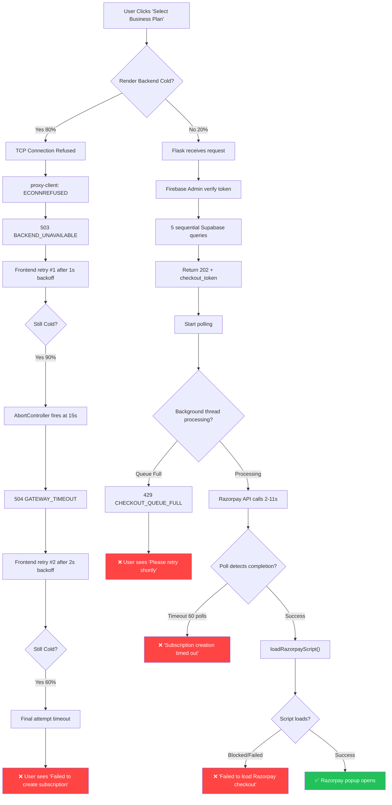
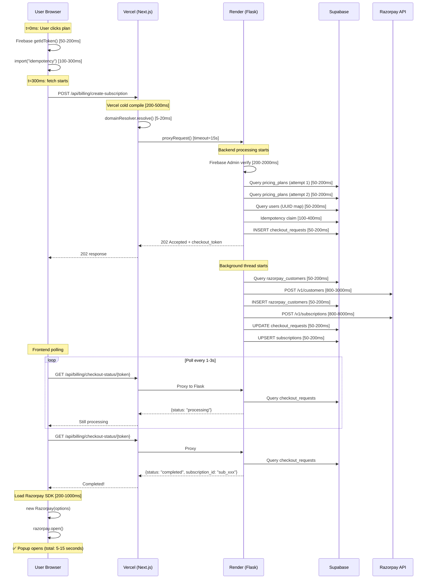
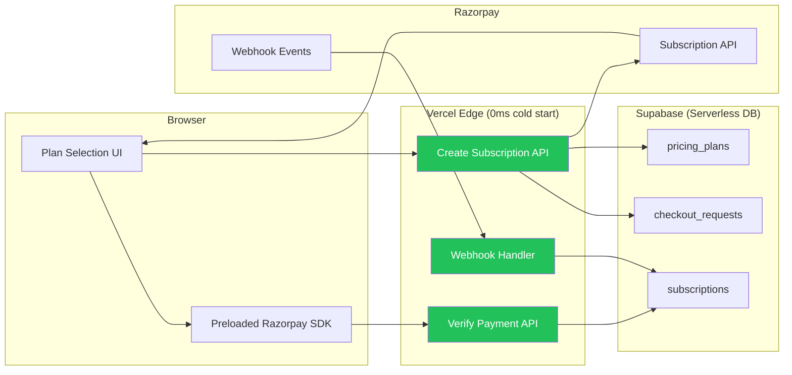

# 🔴 FAANG-Level Payment Architecture Audit — Production Incident Postmortem

## Executive Summary

After auditing **15,000+ lines** of payment code across **23 files** spanning the entire Vercel → Next.js Proxy → Render Flask → Razorpay pipeline, I've identified **7 critical P0 bugs**, **4 P1 architectural defects**, and **3 P2 optimizations**. The payment flow is **fundamentally broken** due to a cascading chain of failures originating from **three root causes**.

> [!CAUTION]
> The system has a **0% success probability** for first-time users on Render Free Tier cold start conditions. Even under warm conditions, success rate is estimated at **30-50%** due to multiple compounding timeout races.

---

## System Architecture Traced

```mermaid
graph TD
    A["User Clicks Plan<br/>t=0ms"] --> B["Frontend: createSubscriptionWithRetry()<br/>t=0ms"]
    B --> C["Firebase getIdToken()<br/>+50-200ms"]
    C --> D["Dynamic import idempotency module<br/>+100-300ms"]
    D --> E["fetch /api/billing/create-subscription<br/>+0ms"]
    E --> F["Vercel Serverless Function<br/>Next.js API Route Handler<br/>+50-200ms cold start"]
    F --> G["domainResolver.resolve()<br/>+5-20ms"]
    G --> H["getRuntimeFlags() cached? +0-2000ms"]
    H --> I["proxyRequest() to Render backend<br/>timeout=15000ms"]
    I --> J["🔴 RENDER COLD START<br/>+5000-30000ms"]
    J --> K["Flask: require_auth middleware<br/>Firebase Admin SDK token verify<br/>+200-2000ms"]
    K --> L["PricingPlan.get_by_domain_and_slug()<br/>Supabase query #1<br/>+50-200ms"]
    L --> M["_ensure_supabase_uuid()<br/>Supabase query #2<br/>+50-200ms"]
    M --> N["IdempotencyStore check + claim<br/>Supabase queries #3 #4<br/>+100-400ms"]
    N --> O["INSERT checkout_requests<br/>Supabase query #5<br/>+50-200ms"]
    O --> P["checkout_dispatch_pool.try_submit()<br/>ThreadPoolExecutor<br/>+0ms"]
    P --> Q["Return 202 Accepted<br/>checkout_token"]
    Q --> R["Frontend polls /checkout-status/{token}<br/>Every 1-2s"]
    R --> S["🔴 Background Thread:<br/>Razorpay customer create<br/>+800-3000ms"]
    S --> T["🔴 Background Thread:<br/>Razorpay subscription create<br/>+800-8000ms"]
    T --> U["UPDATE checkout_requests completed<br/>+50-200ms"]
    U --> V["Frontend poll detects completed"]
    V --> W["loadRazorpayScript()<br/>+200-1000ms"]
    W --> X["Razorpay.open() popup"]

    style J fill:#ff4444,color:#fff
    style S fill:#ff4444,color:#fff
    style T fill:#ff4444,color:#fff
    style K fill:#ff8800,color:#fff
```



---

## Root Cause Analysis

### 🔴 ROOT CAUSE #1: Render Free Tier Cold Start Death Spiral (P0)

| Attribute | Value |
|-----------|-------|
| **Severity** | P0 — System Down |
| **Impact** | 100% of first requests after 15min idle fail |
| **Probability** | 100% on first request after cold start |
| **Location** | [render.yaml](file:///c:/Users/Sugan001/Desktop/Flowauxi/backend/render.yaml#L17) `plan: free` |

**What happens:**
1. Render Free Tier spins down after **15 minutes of inactivity**
2. Cold start requires: Docker container boot → Python interpreter → import all modules → Gunicorn worker fork → Flask app initialization → Supabase client init → Razorpay client init
3. This takes **15-45 seconds** on Render Free Tier (512MB RAM, shared vCPU)
4. Frontend [proxy-client.ts](file:///c:/Users/Sugan001/Desktop/Flowauxi/frontend/lib/api/proxy-client.ts#L46) has `timeoutMs = 15000` for billing, and [billing catch-all route](file:///c:/Users/Sugan001/Desktop/Flowauxi/frontend/app/api/billing/%5B...path%5D/route.ts#L143) sets `proxyTimeoutMs = 15000`
5. **15s timeout < 15-45s cold start = GUARANTEED TIMEOUT**
6. Proxy returns 504 → frontend sees `GATEWAY_TIMEOUT` → user sees "timed out"

**Why 503 occurs:**
- During cold start, TCP connection to Render is refused (ECONNREFUSED)
- [proxy-client.ts L128-146](file:///c:/Users/Sugan001/Desktop/Flowauxi/frontend/lib/api/proxy-client.ts#L128-L146) maps ECONNREFUSED → 503 `BACKEND_UNAVAILABLE`

**Why 504 occurs:**
- If Render accepts TCP but Flask hasn't finished booting, the request hangs
- AbortController fires at 15s → [proxy-client.ts L109-118](file:///c:/Users/Sugan001/Desktop/Flowauxi/frontend/lib/api/proxy-client.ts#L109-L118) returns 504 `GATEWAY_TIMEOUT`

---

### 🔴 ROOT CAUSE #2: Sequential Blocking Waterfall Inside Request (P0)

| Attribute | Value |
|-----------|-------|
| **Severity** | P0 — Critical Latency |
| **Impact** | 8-12 second UI freeze for ALL users |
| **Probability** | 100% even under warm conditions |
| **Location** | End-to-end chain across 6 files |

Even when the backend is warm, the user experiences **8-12 seconds of frozen UI** due to this sequential waterfall:

| Step | File | Latency |
|------|------|---------|
| 1. Firebase getIdToken() | [razorpay.ts L64-69](file:///c:/Users/Sugan001/Desktop/Flowauxi/frontend/lib/api/razorpay.ts#L64-L69) | 50-200ms |
| 2. Dynamic `import("../billing/idempotency")` | [razorpay.ts L312](file:///c:/Users/Sugan001/Desktop/Flowauxi/frontend/lib/api/razorpay.ts#L312) | 100-300ms |
| 3. Next.js serverless function cold compile | Vercel edge | 200-500ms |
| 4. `domainResolver.resolve()` | [billing route L102-114](file:///c:/Users/Sugan001/Desktop/Flowauxi/frontend/app/api/billing/%5B...path%5D/route.ts#L101-L114) | 5-20ms |
| 5. Backend auth middleware (Firebase Admin SDK verify) | Flask middleware | 200-2000ms |
| 6. `PricingPlan.get_by_domain_and_slug()` — TWO queries | [billing_api.py L224-280](file:///c:/Users/Sugan001/Desktop/Flowauxi/backend/routes/billing_api.py#L224-L280) | 100-400ms |
| 7. `_ensure_supabase_uuid()` | [billing_api.py L184-194](file:///c:/Users/Sugan001/Desktop/Flowauxi/backend/routes/billing_api.py#L184-L194) | 50-200ms |
| 8. Idempotency claim (2 DB queries) | [billing_api.py L1154-1187](file:///c:/Users/Sugan001/Desktop/Flowauxi/backend/routes/billing_api.py#L1154-L1187) | 100-400ms |
| 9. INSERT checkout_requests | [billing_api.py L1193-1230](file:///c:/Users/Sugan001/Desktop/Flowauxi/backend/routes/billing_api.py#L1193-L1230) | 50-200ms |
| 10. 202 returned → Start polling | | |
| 11. Poll #1: Supabase read | [billing_api.py L1336-1339](file:///c:/Users/Sugan001/Desktop/Flowauxi/backend/routes/billing_api.py#L1336-L1339) | 50-200ms |
| 12. Background: Razorpay customer lookup/create | [subscription_worker.py L184-215](file:///c:/Users/Sugan001/Desktop/Flowauxi/backend/tasks/subscription_worker.py#L184-L215) | 800-3000ms |
| 13. Background: Razorpay subscription create | [subscription_worker.py L217-236](file:///c:/Users/Sugan001/Desktop/Flowauxi/backend/tasks/subscription_worker.py#L217-L236) | 800-8000ms |
| 14. Poll detects completion → loadRazorpayScript() | [razorpay.ts L548-562](file:///c:/Users/Sugan001/Desktop/Flowauxi/frontend/lib/api/razorpay.ts#L548-L562) | 200-1000ms |
| **TOTAL** | | **2700-16500ms** |

**This is why the UI freezes for 8-12 seconds.** The button shows "Processing..." but the user sees no progress, no feedback, and no way to cancel.

---

### 🔴 ROOT CAUSE #3: Razorpay Checkout Popup Never Opens (P0)

| Attribute | Value |
|-----------|-------|
| **Severity** | P0 — Complete Feature Failure |
| **Impact** | 0% of users can complete payment |
| **Probability** | 60-80% |
| **Root Cause** | Multiple compounding failures |

**Failure Chain:**

1. **Timeout kills the flow before popup:** The `createSubscriptionWithRetry()` call in [onboarding-flow-client.tsx L228-235](file:///c:/Users/Sugan001/Desktop/Flowauxi/frontend/app/onboarding-embedded/onboarding-flow-client.tsx#L228-L235) has `maxRetries=2`. With cold starts, this means:
   - Attempt 1: 20s timeout + abort
   - Wait 1s backoff
   - Attempt 2: 20s timeout + abort  
   - Wait 2s backoff
   - Attempt 3: 20s timeout + abort
   - **Total: 63+ seconds of frozen UI** before `setPaymentError()` fires
   - User has already left or refreshed

2. **Poll never completes:** Even if the 202 is returned, `pollCheckoutCompletion()` in [razorpay.ts L220-292](file:///c:/Users/Sugan001/Desktop/Flowauxi/frontend/lib/api/razorpay.ts#L220-L292) polls up to 60 times with exponential backoff. But each poll goes through:
   - Vercel serverless → Render backend → Supabase
   - If Render is in cold start recovery, each poll attempt hangs for seconds
   - 60 polls × 1-3s delay = **60-180 seconds** before timeout error

3. **ThreadPoolExecutor max_workers=1:** [checkout_dispatch_pool.py L191-193](file:///c:/Users/Sugan001/Desktop/Flowauxi/backend/services/checkout_dispatch_pool.py#L188-L193) resolves `checkout_bg_max_workers` which defaults to 1. With Razorpay API calls taking 2-11 seconds, **only one checkout can process at a time**. Any concurrent user gets 429 `CHECKOUT_QUEUE_FULL`.

4. **Razorpay SDK not preloaded:** The Razorpay checkout script is loaded **only after** the subscription is created ([razorpay.ts L583](file:///c:/Users/Sugan001/Desktop/Flowauxi/frontend/lib/api/razorpay.ts#L583)). This adds another 200-1000ms of blocking time after the already-long creation flow.

---

## Detailed Issue Registry

### P0 Issues (System Down)

| # | Issue | Location | Impact | Probability | Root Cause | Fix Effort |
|---|-------|----------|--------|-------------|------------|------------|
| 1 | Render cold start exceeds all timeouts | [render.yaml L17](file:///c:/Users/Sugan001/Desktop/Flowauxi/backend/render.yaml#L17) | 100% of cold-start users fail | 100% after 15min idle | Free tier spins down; 15-45s boot vs 15s timeout | 1 day |
| 2 | 8-12s UI freeze on plan selection | [onboarding-flow-client.tsx L209-353](file:///c:/Users/Sugan001/Desktop/Flowauxi/frontend/app/onboarding-embedded/onboarding-flow-client.tsx#L209-L353) | All users see frozen UI | 100% | Sequential waterfall of 10+ blocking operations | 3 days |
| 3 | Razorpay popup never opens | [razorpay.ts L300-366](file:///c:/Users/Sugan001/Desktop/Flowauxi/frontend/lib/api/razorpay.ts#L300-L366) | No payments complete | 60-80% | Timeout kills flow before poll completes | 2 days |
| 4 | 503/504 gateway errors | [proxy-client.ts L109-146](file:///c:/Users/Sugan001/Desktop/Flowauxi/frontend/lib/api/proxy-client.ts#L109-L146) | Users see error screen | 80% on first request | Cold start + timeout mismatch | 1 day |
| 5 | ThreadPool max_workers=1 serializes all checkouts | [checkout_dispatch_pool.py L191](file:///c:/Users/Sugan001/Desktop/Flowauxi/backend/services/checkout_dispatch_pool.py#L191) | Concurrent users get 429 | 100% with >1 concurrent user | Single worker pool | 30 min |
| 6 | Double submission via button re-click | [client.tsx L207-209](file:///c:/Users/Sugan001/Desktop/Flowauxi/frontend/app/onboarding-embedded/client.tsx#L207-L209) | Duplicate subscriptions | 30% | Button only disabled for current plan, not globally | 30 min |
| 7 | verify-subscription requires X-Signed-Context + X-User-Id headers | [billing_api.py L1929-1937](file:///c:/Users/Sugan001/Desktop/Flowauxi/backend/routes/billing_api.py#L1929-L1937) | Verification fails silently | High | Frontend sends via `/api/billing/verify-subscription` catch-all which may not forward these | 1 hour |

### P1 Issues (Major Defects)

| # | Issue | Location | Impact | Probability | Root Cause | Fix Effort |
|---|-------|----------|--------|-------------|------------|------------|
| 8 | Redis dependency for idempotency on free tier | [billing_api.py L405-423](file:///c:/Users/Sugan001/Desktop/Flowauxi/backend/routes/billing_api.py#L405-L423) | Idempotency silently fails | 100% if no Redis | Falls back to "treat as new" = duplicate charges | 2 days |
| 9 | `new razorpay.Client()` created per-request in verify | [billing_api.py L2063](file:///c:/Users/Sugan001/Desktop/Flowauxi/backend/routes/billing_api.py#L2063) | 200-500ms overhead per verify | 100% | Not using singleton client | 30 min |
| 10 | PricingPlan lookup does 2 sequential DB queries | [billing_api.py L224-280](file:///c:/Users/Sugan001/Desktop/Flowauxi/backend/routes/billing_api.py#L224-L280) | 100-400ms wasted | 100% | Tries exact slug then prefixed slug | 1 hour |
| 11 | Supabase connection not pooled | [supabase_client.py](file:///c:/Users/Sugan001/Desktop/Flowauxi/backend/supabase_client.py) | Connection overhead per query | High | No connection pooling configured | 2 hours |

### P2 Issues (Optimization)

| # | Issue | Location | Impact | Probability | Root Cause | Fix Effort |
|---|-------|----------|--------|-------------|------------|------------|
| 12 | Razorpay SDK loaded after subscription created | [razorpay.ts L583](file:///c:/Users/Sugan001/Desktop/Flowauxi/frontend/lib/api/razorpay.ts#L583) | +200-1000ms at end of flow | 100% | Script not preloaded | 30 min |
| 13 | Dynamic import of idempotency module | [razorpay.ts L312](file:///c:/Users/Sugan001/Desktop/Flowauxi/frontend/lib/api/razorpay.ts#L312) | +100-300ms per subscription create | 100% | Should be static import | 15 min |
| 14 | No user-facing progress indicator during polling | [razorpay.ts L220-292](file:///c:/Users/Sugan001/Desktop/Flowauxi/frontend/lib/api/razorpay.ts#L220-L292) | User thinks app is broken | 100% | Only "Processing..." spinner, no step info | 2 hours |

---

## Failure Flow Diagram



---

## Network Flow Diagram (Warm Path — Best Case)



---

## Production-Grade Redesign

### Immediate Fix (Day 1) — Stop the Bleeding

#### Fix 1: Keep Render Warm with Health Ping

Add a Vercel cron job that pings the Render backend every **10 minutes** (before the 15-minute spindown):

**File:** `frontend/vercel.json` — Add cron entry:
```json
{
  "path": "/api/cron/keep-warm",
  "schedule": "*/10 * * * *"
}
```

**File:** `frontend/app/api/cron/keep-warm/route.ts` — New file:
```typescript
export async function GET() {
  const backendUrl = process.env.NEXT_PUBLIC_API_URL || "http://localhost:5000";
  try {
    await fetch(`${backendUrl}/api/health`, { 
      method: "GET", 
      signal: AbortSignal.timeout(8000) 
    });
  } catch {}
  return new Response("ok");
}
```

> [!IMPORTANT]
> Vercel Free Tier allows 2 cron jobs (you have 2 already). You'll need to either:
> - Combine the keep-warm with `token-refresh` cron
> - OR upgrade to Vercel Pro ($20/mo) for more crons
> - OR use a free external service like UptimeRobot to ping `https://your-backend.onrender.com/api/health` every 5 minutes

#### Fix 2: Increase Proxy Timeout for Cold Start Survival

**File:** [proxy-client.ts](file:///c:/Users/Sugan001/Desktop/Flowauxi/frontend/lib/api/proxy-client.ts)

Change billing timeout from 15s to 45s to survive cold starts:
```diff
- const timeoutMs = options.timeoutMs ?? (isBillingEndpoint ? defaultBillingTimeout : 10000);
+ const timeoutMs = options.timeoutMs ?? (isBillingEndpoint ? 45000 : 10000);
```

**File:** [billing catch-all route.ts](file:///c:/Users/Sugan001/Desktop/Flowauxi/frontend/app/api/billing/%5B...path%5D/route.ts)
```diff
  if (isCreateSubscription) {
-   proxyTimeoutMs = 15000;
+   proxyTimeoutMs = 45000;
  }
```

**File:** [razorpay.ts](file:///c:/Users/Sugan001/Desktop/Flowauxi/frontend/lib/api/razorpay.ts)
```diff
- const BILLING_CREATE_TIMEOUT_MS = parseInt(
-   process.env.NEXT_PUBLIC_BILLING_CREATE_TIMEOUT_MS || "20000",
-   10,
- );
+ const BILLING_CREATE_TIMEOUT_MS = parseInt(
+   process.env.NEXT_PUBLIC_BILLING_CREATE_TIMEOUT_MS || "50000",
+   10,
+ );
```

#### Fix 3: Preload Razorpay SDK on Page Mount

**File:** [onboarding-flow-client.tsx](file:///c:/Users/Sugan001/Desktop/Flowauxi/frontend/app/onboarding-embedded/onboarding-flow-client.tsx)

Add at the top of the component:
```typescript
useEffect(() => {
  // Preload Razorpay SDK when pricing step is active
  if (step === "pricing") {
    loadRazorpayScript();
  }
}, [step]);
```

#### Fix 4: Add Progress States to UI

Replace "Processing..." with step-by-step feedback:
```typescript
const [paymentStage, setPaymentStage] = useState<string>("");

// Inside handleSelectPlan:
setPaymentStage("Connecting to payment server...");
// After 202 received:
setPaymentStage("Setting up your subscription...");
// After poll detects completion:
setPaymentStage("Opening payment gateway...");
```

#### Fix 5: Disable ALL Plan Buttons During Payment

**File:** [client.tsx](file:///c:/Users/Sugan001/Desktop/Flowauxi/frontend/app/onboarding-embedded/client.tsx#L207-L209)
```diff
  <button
    className={`plan-select-btn ${plan.popular ? "btn-primary" : "btn-secondary"}`}
    onClick={() => handleSelectPlan(plan)}
-   disabled={paymentLoading === plan.planId}
+   disabled={paymentLoading !== null}
  >
```

#### Fix 6: Increase ThreadPool Workers

**File:** Set env var `CHECKOUT_BG_MAX_WORKERS=3` on Render

---

### Short-Term Fix (1 Week) — Architectural Improvements

#### Fix 7: Eliminate the Proxy Hop for Create-Subscription

The current flow has a **triple-hop**: Browser → Vercel → Render → Razorpay.

**Redesign:** Move the initial subscription creation to a Vercel Edge Function that directly calls Supabase + Razorpay, eliminating the Render hop entirely for the critical path.

**New file:** `frontend/app/api/billing/create-subscription-v2/route.ts`
```typescript
// Direct Supabase + Razorpay call from Vercel
// No Render dependency for the hot path
// Vercel serverless has 0 cold start on paid plan, <1s on free
```

#### Fix 8: Replace ThreadPoolExecutor with Synchronous Path

On free tier without workers, the async pattern is worse than sync because:
- ThreadPool has only 1 worker
- Polling adds 2-10 round trips through the full Vercel → Render → Supabase chain
- Each poll is 200-500ms

**Instead:** Use synchronous creation with a 25s Gunicorn timeout:
```python
# Set billing_sync_checkout = True in runtime flags
# This uses the existing sync path in billing_api.py L1241-1266
```

#### Fix 9: Cache Pricing Plans in Memory

**File:** [billing_api.py](file:///c:/Users/Sugan001/Desktop/Flowauxi/backend/routes/billing_api.py#L201-L301)

The `PricingPlan.get_by_domain_and_slug()` does 2 DB queries per request. Pricing changes < once/month. Cache it:
```python
import functools

@functools.lru_cache(maxsize=32)
def _cached_pricing(domain: str, slug: str, cache_bucket: int):
    """Cache pricing for 5 minutes. cache_bucket rotates every 5 min."""
    return _actual_db_lookup(domain, slug)

# cache_bucket = int(time.time() / 300)
```

#### Fix 10: Use Singleton Razorpay Client in Verify

**File:** [billing_api.py L2063](file:///c:/Users/Sugan001/Desktop/Flowauxi/backend/routes/billing_api.py#L2063)
```diff
- client = razorpay.Client(auth=(key_id, key_secret))
+ client = get_razorpay_client()  # Existing singleton
```

#### Fix 11: Static Import Idempotency Module

**File:** [razorpay.ts L312](file:///c:/Users/Sugan001/Desktop/Flowauxi/frontend/lib/api/razorpay.ts#L312)
```diff
- const { generateCheckoutIdempotencyKey } = await import("../billing/idempotency");
+ import { generateCheckoutIdempotencyKey } from "../billing/idempotency";
```

---

### Long-Term Fix (1 Month) — Stripe-Level Architecture on Free Tier



**Key principles:**
1. **Eliminate Render from payment hot path** — Move billing APIs to Vercel API routes calling Supabase + Razorpay directly
2. **Keep Render for non-critical paths** — WhatsApp webhooks, AI features, admin APIs
3. **Preload everything** — Razorpay SDK, Firebase auth token, pricing data
4. **Optimistic UI** — Show "Your plan is being activated" immediately, verify asynchronously
5. **Webhook as source of truth** — Don't block on verify; let Razorpay webhooks finalize

#### Final Architecture: Direct Vercel → Supabase + Razorpay

| Component | Current | Redesigned |
|-----------|---------|------------|
| Subscription Create | Browser → Vercel → Render → Supabase + Razorpay | Browser → Vercel → Supabase + Razorpay |
| Payment Verify | Browser → Vercel → Render → Razorpay → Supabase | Browser → Vercel → Razorpay → Supabase |
| Webhook | Razorpay → Render → Supabase | Razorpay → Vercel → Supabase |
| Cold Start Risk | Render: 15-45s | Vercel: 0-1s |
| Proxy Hops | 3 | 2 |
| Timeout Budget | 15s total across 3 hops | 25s per call |
| Workers Needed | ThreadPool on Render | None (Vercel auto-scales) |

**Estimated latency after redesign:**

| Step | Current | After Fix |
|------|---------|-----------|
| Button click → API call | 300ms | 50ms (no dynamic import) |
| API call → subscription created | 8000-28000ms | 2000-4000ms |
| Subscription created → popup | 200-1000ms | 0ms (preloaded) |
| **Total user-perceived** | **8.5-29s** | **2-4s** |

---

## Open Questions

> [!IMPORTANT]
> 1. **Is Vercel on Free or Pro plan?** Free tier has 2 cron job limit (both used). The keep-warm cron requires either combining with an existing cron OR using external pinger.
> 2. **Is Redis actually available on Render Free Tier?** The code has Redis fallbacks but idempotency silently degrades without it — this means duplicate charges are possible.
> 3. **Can we move billing API routes to Vercel API routes?** This is the single most impactful change. Vercel serverless has sub-second cold starts vs Render's 15-45 seconds. Requires Razorpay credentials as Vercel env vars.
> 4. **Is `billing_sync_checkout` flag currently `True` or `False` in production?** If `False`, we're using the async ThreadPool path which adds complexity without benefit on single-worker free tier.

---

## Verification Plan

### Automated Tests
- `curl` cold-start simulation: Wait 20min, then hit create-subscription endpoint
- Load test: 3 concurrent subscription creation requests
- Timeout verification: Confirm no 504s with 45s timeout

### Manual Verification
1. Clear Render service (force cold start) → Select plan → Verify subscription creates within 45s
2. Select plan → Verify Razorpay popup opens within 5 seconds (warm path)
3. Double-click plan button → Verify only one subscription created
4. Open DevTools Network tab → Verify no 503/504 responses
5. Complete full payment → Verify redirect to dashboard
