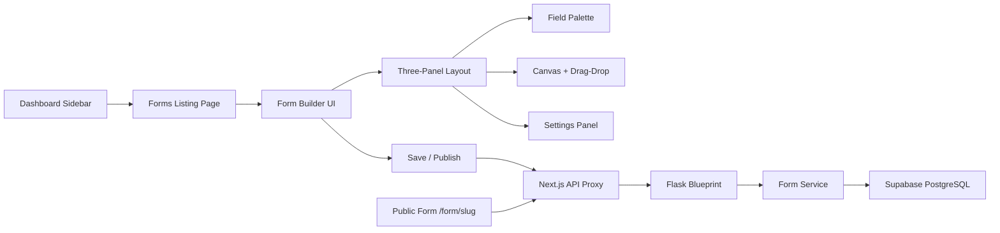

# Enterprise Form Builder — Implementation Walkthrough

## What Was Built

A production-grade Form Builder system integrated into the existing Flowauxi architecture, with **17 new files** and **3 existing file modifications**.

## Architecture Overview

---

## Files Created & Modified

### Backend (4 new files + 1 modification)

| File | Purpose |
|------|---------|
| [create_forms_tables.sql](file:///c:/Users/Sugan001/Desktop/Flowauxi/backend/migrations/create_forms_tables.sql) | 4 tables, indexes, triggers, RLS policies |
| [form_entities.py](file:///c:/Users/Sugan001/Desktop/Flowauxi/backend/domain/form_entities.py) | DDD domain entities with state transitions |
| [form_service.py](file:///c:/Users/Sugan001/Desktop/Flowauxi/backend/services/form_service.py) | Business logic: CRUD, publish, submit, responses |
| [forms_api.py](file:///c:/Users/Sugan001/Desktop/Flowauxi/backend/routes/forms_api.py) | Flask Blueprint with 12 REST endpoints |
| [app.py](file:///c:/Users/Sugan001/Desktop/Flowauxi/backend/app.py) | Added blueprint registration |

### Frontend API Routes (7 new files)

| File | Endpoints |
|------|-----------|
| [/api/forms/route.ts](file:///c:/Users/Sugan001/Desktop/Flowauxi/frontend/app/api/forms/route.ts) | GET (list), POST (create) |
| [/api/forms/[id]/route.ts](file:///c:/Users/Sugan001/Desktop/Flowauxi/frontend/app/api/forms/%5Bid%5D/route.ts) | GET, PUT, DELETE |
| [/api/forms/[id]/publish/route.ts](file:///c:/Users/Sugan001/Desktop/Flowauxi/frontend/app/api/forms/%5Bid%5D/publish/route.ts) | POST |
| [/api/forms/[id]/fields/route.ts](file:///c:/Users/Sugan001/Desktop/Flowauxi/frontend/app/api/forms/%5Bid%5D/fields/route.ts) | GET, PUT |
| [/api/forms/[id]/responses/route.ts](file:///c:/Users/Sugan001/Desktop/Flowauxi/frontend/app/api/forms/%5Bid%5D/responses/route.ts) | GET (paginated) |
| [/api/forms/public/[slug]/route.ts](file:///c:/Users/Sugan001/Desktop/Flowauxi/frontend/app/api/forms/public/%5Bslug%5D/route.ts) | GET (public), POST (submit) |

### Frontend UI (4 new files)

| File | Purpose |
|------|---------|
| [forms.module.css](file:///c:/Users/Sugan001/Desktop/Flowauxi/frontend/app/dashboard/forms/forms.module.css) | CSS Module (600+ lines) |
| [forms/page.tsx](file:///c:/Users/Sugan001/Desktop/Flowauxi/frontend/app/dashboard/forms/page.tsx) | Forms listing with grid cards |
| [builder/[id]/page.tsx](file:///c:/Users/Sugan001/Desktop/Flowauxi/frontend/app/dashboard/forms/builder/%5Bid%5D/page.tsx) | Three-panel drag-and-drop builder |
| [form/[slug]/page.tsx](file:///c:/Users/Sugan001/Desktop/Flowauxi/frontend/app/form/%5Bslug%5D/page.tsx) | Public form renderer + submission |
| [form-public.module.css](file:///c:/Users/Sugan001/Desktop/Flowauxi/frontend/app/form/%5Bslug%5D/form-public.module.css) | Public form styling |

### Dashboard Integration (2 modifications)

| File | Changes |
|------|---------|
| [layout.tsx](file:///c:/Users/Sugan001/Desktop/Flowauxi/frontend/app/dashboard/layout.tsx) | Added `"forms"` to Section type, labels, and route detection |
| [DashboardSidebar.tsx](file:///c:/Users/Sugan001/Desktop/Flowauxi/frontend/app/dashboard/components/DashboardSidebar.tsx) | Added Forms nav item with icon |
| [proxy.ts](file:///c:/Users/Sugan001/Desktop/Flowauxi/frontend/proxy.ts) | Added `/form` and `/api/forms/public` to public routes |

---

## Supported Field Types

| Category | Types |
|----------|-------|
| **Basic** | Text, Email, Phone, Number, URL, Paragraph |
| **Choice** | Dropdown, Radio, Checkbox, Multi Select |
| **Advanced** | Date Picker, File Upload, Hidden Field |
| **Layout** | Heading, Divider |

## Next Steps

> [!IMPORTANT]
> **Before testing**, run the SQL migration in your Supabase SQL Editor:
> Open [create_forms_tables.sql](file:///c:/Users/Sugan001/Desktop/Flowauxi/backend/migrations/create_forms_tables.sql) and execute it.

1. Run the SQL migration in Supabase
2. Start the backend (`flask run` or `gunicorn`)
3. Start the frontend (`npm run dev`)
4. Navigate to `/dashboard/forms` → "Create Form"
5. Build a form → Publish → Visit `/form/{slug}`
