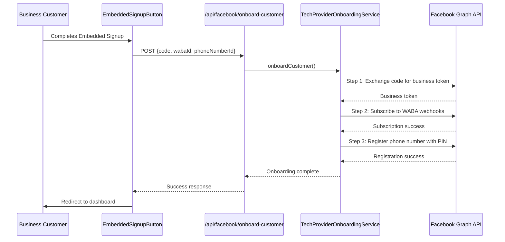

# Tech Provider Customer Onboarding - Summary

## What It Does

After a customer completes WhatsApp Embedded Signup, the system automatically performs these critical steps:

1. **Token Exchange**: Converts the short-lived authorization code into a long-lived business integration system user access token
2. **Webhook Subscription**: Subscribes your app to webhooks on the customer's WhatsApp Business Account (WABA)
3. **Phone Number Registration**: Registers the customer's business phone number for Cloud API use with a secure 2-step verification PIN

## Implementation Files

| File                                                                                                                                                       | Purpose                                            |
| ---------------------------------------------------------------------------------------------------------------------------------------------------------- | -------------------------------------------------- |
| [`lib/facebook/tech-provider-onboarding.ts`](file:///c:/Users/Sugan001/Desktop/reviseit/frontend/lib/facebook/tech-provider-onboarding.ts)                 | Service layer handling all 3 onboarding steps      |
| [`app/api/facebook/onboard-customer/route.ts`](file:///c:/Users/Sugan001/Desktop/reviseit/frontend/app/api/facebook/onboard-customer/route.ts)             | API endpoint for customer onboarding               |
| [`app/components/facebook/EmbeddedSignupButton.tsx`](file:///c:/Users/Sugan001/Desktop/reviseit/frontend/app/components/facebook/EmbeddedSignupButton.tsx) | Calls onboarding API after Embedded Signup success |

## Flow Diagram



## How It Works

### Automatic Onboarding

When a customer completes Embedded Signup:

1. Message event listener captures WABA ID and phone number ID
2. `EmbeddedSignupButton` calls `/api/facebook/embedded-signup` (saves data to database)
3. `EmbeddedSignupButton` then calls `/api/facebook/onboard-customer` (performs Tech Provider steps)
4. Customer is fully onboarded and ready to use WhatsApp

### Request Format

```typescript
POST /api/facebook/onboard-customer
{
  "code": "AQBhlXsctMxJYbw...",  // Authorization code from Embedded Signup
  "wabaId": "102290129340398",   // From message event
  "phoneNumberId": "106540352242922",  // From message event
  "pin": "123456"  // Optional: custom PIN, otherwise random 6-digit
}
```

### Response Format

```typescript
{
  "success": true,
  "data": {
    "wabaId": "102290129340398",
    "phoneNumberId": "106540352242922",
    "webhookSubscribed": true,
    "phoneRegistered": true,
    "summary": {
      "message": "Customer onboarding completed successfully",
      "nextSteps": [
        "Customer is now onboarded",
        "Phone number is registered for Cloud API",
        "Webhooks are subscribed",
        "Customer should add payment method..."
      ]
    }
  }
}
```

## Security Features

1. **Business Token Storage**: Business token is NOT returned to client, only stored server-side
2. **User Session Verification**: Requires valid Firebase session cookie
3. **Automated PIN Generation**: Random 6-digit PIN for phone number security
4. **Error Handling**: Non-blocking - if onboarding fails, user can complete manually

## Testing

### Test Complete Flow

1. Complete Embedded Signup in your app
2. Check browser console for:
   ```
   🚀 [EmbeddedSignup] Calling onboarding API...
   🎉 [EmbeddedSignup] Customer onboarded successfully!
   ```
3. Check server logs for:
   ```
   🚀 [Onboarding] Starting customer onboarding...
   ✅ [Onboarding] Business token obtained
   ✅ [Onboarding] Webhooks subscribed
   ✅ [Onboarding] Phone number registered
   🎉 [Onboarding] Customer onboarding completed successfully
   ```

### Test Individual Steps (Optional)

You can also call the onboarding API directly for testing:

```bash
curl -X POST http://localhost:3000/api/facebook/onboard-customer \
  -H "Content-Type: application/json" \
  -H "Cookie: session=YOUR_SESSION_COOKIE" \
  -d '{
    "code": "AQBhlXsctMxJYbw...",
    "wabaId": "102290129340398",
    "phoneNumberId": "106540352242922"
  }'
```

## Customer Next Steps

After successful onboarding, customers must add a payment method:

1. Navigate to [WhatsApp Manager](https://business.facebook.com/wa/manage/home/)
2. Click "Add payment method"
3. Complete the payment setup flow

Once payment is added, the customer is fully operational!

## Troubleshooting

### Onboarding fails but Embedded Signup succeeded

- **Non-critical**: Customer data is already saved from embedded-signup endpoint
- **Solution**: Customer can complete onboarding manually in WhatsApp Manager
- **Check**: Server logs for specific error in onboarding steps

### "Failed to exchange token" error

- **Cause**: Authorization code already used or expired
- **Solution**: Codes are single-use; customer needs to go through Embedded Signup again
- **Prevention**: Ensure code is passed immediately to onboarding

### Phone registration fails

- **Cause**: Phone number already registered elsewhere
- **Solution**: Customer can change PIN in WhatsApp Manager
- **Note**: This is non-critical; phone can be used even if registration fails

## Environment Variables

No additional environment variables required! Uses existing:

- `NEXT_PUBLIC_FACEBOOK_APP_ID`
- `FACEBOOK_APP_SECRET`

## Next Enhancements

Consider adding:

1. **Test Message Sending**: Implement test message functionality in UI
2. **Payment Status Check**: Monitor when customer adds payment method
3. **Onboarding Status Dashboard**: Show onboarding progress to customers
4. **Manual Retry**: Allow customers to retry failed onboarding steps
