# 🚀 FLOWAUXI SEO DOMINATION STRATEGY — PRINCIPAL ARCHITECT BLUEPRINT
## From 0 → 100K Organic Traffic | Production-Grade | 2026

**Target**: https://shop.flowauxi.com
**Product**: WhatsApp-powered ecommerce builder with AI chatbot, order automation, invoice delivery, and payment integration
**Audience**: SMBs, creators, local sellers, D2C brands (India-first → Global)
**Monetization**: Freemium SaaS (Free website + paid plans from ₹1,999/month)

---

> [!IMPORTANT]
> This strategy builds upon the existing `SEO-STRATEGY.md` (2,376 lines) and `lib/seo/` implementation (15 TypeScript files). This document focuses on **actionable gaps, new deliverables, and execution-ready specifications** not yet covered.

---

# 📋 TABLE OF CONTENTS

1. [Keyword Strategy (FAANG-Level)](#1-keyword-strategy)
2. [Site Architecture (SEO-First)](#2-site-architecture)
3. [Technical SEO (Production Grade)](#3-technical-seo)
4. [Content Strategy (Ranking Engine)](#4-content-strategy)
5. [Conversion SEO (Revenue Driven)](#5-conversion-seo)
6. [Backlink Strategy (Authority Building)](#6-backlink-strategy)
7. [Programmatic SEO (Growth Hack)](#7-programmatic-seo)
8. [Competitor Reverse Engineering](#8-competitor-reverse-engineering)
9. [Execution Roadmap (0 → 100K)](#9-execution-roadmap)
10. [Hidden Growth Hacks (FAANG Secrets)](#10-hidden-growth-hacks)

---

# 1. KEYWORD STRATEGY

## 1.1 — 50 High-Volume Keywords (Short-Tail)

| # | Keyword | Volume (IN) | Volume (Global) | KD | Intent | Cluster | Target URL |
|---|---------|------------|----------------|-----|--------|---------|------------|
| 1 | free website builder | 22,000 | 201,000 | 50 | Transactional | Store Builder | `/free-website-builder` |
| 2 | create online store free | 18,000 | 165,000 | 55 | Transactional | Store Builder | `/create-online-store-free` |
| 3 | whatsapp chatbot for business | 14,000 | 48,000 | 40 | Commercial | AI Chatbot | `/features/ai-chatbot` |
| 4 | free online store india | 14,000 | 14,500 | 45 | Transactional | Store Builder | `/create-online-store-free` |
| 5 | online store builder | 12,000 | 110,000 | 45 | Commercial | Store Builder | `/online-store-builder` |
| 6 | shopify alternatives | 12,000 | 74,000 | 60 | Commercial | Comparisons | `/compare/shopify` |
| 7 | online store india | 9,500 | 12,000 | 50 | Transactional | Store Builder | `/online-store-builder` |
| 8 | online store builder free | 9,800 | 45,000 | 48 | Transactional | Store Builder | `/create-online-store-free` |
| 9 | ecommerce website builder | 8,500 | 74,000 | 48 | Commercial | Store Builder | `/ecommerce-website-builder` |
| 10 | best free website builder | 8,500 | 60,000 | 55 | Commercial | Store Builder | `/free-website-builder` |
| 11 | start online store | 8,100 | 40,000 | 55 | Transactional | Store Builder | `/online-store-builder` |
| 12 | free ecommerce website | 6,800 | 33,000 | 52 | Transactional | Store Builder | `/create-online-store-free` |
| 13 | whatsapp store builder | 6,500 | 14,800 | 25 | Commercial | WhatsApp Commerce | `/features/whatsapp-store` |
| 14 | best ecommerce platform india | 6,500 | 7,200 | 55 | Commercial | Comparisons | `/compare` |
| 15 | best whatsapp chatbot | 6,500 | 18,000 | 35 | Commercial | AI Chatbot | `/features/ai-chatbot` |
| 16 | no code store builder | 5,800 | 28,000 | 42 | Commercial | Store Builder | `/online-store-builder` |
| 17 | website builder for small business | 5,200 | 33,000 | 50 | Commercial | Store Builder | `/online-store-builder` |
| 18 | shopify alternative india | 4,800 | 5,400 | 35 | Commercial | Comparisons | `/compare/shopify` |
| 19 | sell on whatsapp | 4,800 | 12,000 | 30 | Transactional | WhatsApp Commerce | `/features/whatsapp-store` |
| 20 | send invoice via whatsapp | 4,500 | 8,800 | 25 | Transactional | Invoice & Payment | `/features/invoice-automation` |
| 21 | ecommerce automation | 4,200 | 22,000 | 45 | Commercial | Automation | `/features/order-automation` |
| 22 | whatsapp payment integration | 3,600 | 9,200 | 28 | Transactional | Invoice & Payment | `/features/invoice-automation` |
| 23 | sell on whatsapp in india | 3,600 | 3,800 | 22 | Transactional | WhatsApp Commerce | `/features/whatsapp-store` |
| 24 | whatsapp business store | 3,200 | 8,400 | 30 | Transactional | WhatsApp Commerce | `/features/whatsapp-store` |
| 25 | free online store builder india | 3,200 | 3,600 | 38 | Transactional | Store Builder | `/create-online-store-free` |
| 26 | woocommerce alternative | 3,200 | 14,000 | 40 | Commercial | Comparisons | `/compare/woocommerce` |
| 27 | ecommerce platform | 3,000 | 60,000 | 62 | Commercial | Store Builder | `/ecommerce-website-builder` |
| 28 | dukaan alternative | 2,400 | 2,800 | 20 | Commercial | Comparisons | `/compare/dukaan` |
| 29 | automated order processing | 2,200 | 12,000 | 35 | Commercial | Automation | `/features/order-automation` |
| 30 | whatsapp ecommerce platform | 2,100 | 5,600 | 25 | Transactional | WhatsApp Commerce | `/features/whatsapp-store` |
| 31 | automated invoice generation | 1,800 | 8,200 | 30 | Commercial | Invoice & Payment | `/features/invoice-automation` |
| 32 | chatbot vs live agent | 1,800 | 6,400 | 25 | Informational | AI Chatbot | `/blog/chatbot-vs-live-agent` |
| 33 | sell on whatsapp without website | 1,600 | 2,200 | 15 | Transactional | WhatsApp Commerce | `/blog/sell-on-whatsapp-without-website` |
| 34 | whatsapp order tracking | 1,400 | 4,800 | 22 | Transactional | Automation | `/features/order-automation` |
| 35 | ai chatbot for ecommerce | 1,200 | 8,800 | 35 | Commercial | AI Chatbot | `/features/ai-chatbot` |
| 36 | whatsapp product catalog | 1,200 | 6,200 | 20 | Transactional | WhatsApp Commerce | `/features/whatsapp-store` |
| 37 | razorpay whatsapp integration | 1,200 | 1,500 | 18 | Transactional | Invoice & Payment | `/blog/razorpay-whatsapp-integration` |
| 38 | best whatsapp chatbot ecommerce | 1,200 | 3,200 | 35 | Commercial | AI Chatbot | `/blog/best-whatsapp-chatbot-ecommerce` |
| 39 | gst invoice whatsapp | 980 | 1,100 | 12 | Transactional | Invoice & Payment | `/blog/gst-invoice-whatsapp` |
| 40 | ecommerce platform for whatsapp | 890 | 2,400 | 15 | Transactional | WhatsApp Commerce | `/features/whatsapp-store` |
| 41 | wati alternative | 890 | 1,800 | 18 | Commercial | Comparisons | `/compare/wati` |
| 42 | whatsapp chatbot pricing | 880 | 3,200 | 22 | Commercial | AI Chatbot | `/pricing` |
| 43 | whatsapp order automation | 880 | 2,600 | 20 | Transactional | Automation | `/features/order-automation` |
| 44 | automate orders on whatsapp | 880 | 1,800 | 18 | Transactional | Automation | `/blog/automate-orders-on-whatsapp` |
| 45 | order confirmation whatsapp | 890 | 2,200 | 15 | Transactional | Automation | `/features/order-automation` |
| 46 | whatsapp invoice generator | 720 | 1,800 | 12 | Transactional | Invoice & Payment | `/features/invoice-automation` |
| 47 | ai chatbot return on investment | 720 | 3,800 | 28 | Informational | AI Chatbot | `/blog/ai-chatbot-roi` |
| 48 | whatsapp marketing template | 720 | 4,200 | 22 | Informational | WhatsApp Commerce | `/blog/whatsapp-marketing-templates` |
| 49 | delivery status updates whatsapp | 720 | 1,400 | 10 | Transactional | Automation | `/features/order-automation` |
| 50 | invoice automation small business | 560 | 2,800 | 20 | Commercial | Invoice & Payment | `/features/invoice-automation` |

---

## 1.2 — 100 Long-Tail Keywords (High Intent)

### WhatsApp Commerce Cluster (25 keywords)

| # | Keyword | Volume | KD | Intent | Target URL |
|---|---------|--------|-----|--------|------------|
| 1 | how to sell clothes on whatsapp | 320 | 12 | Info | `/blog/sell-clothes-on-whatsapp` |
| 2 | how to create whatsapp store for business | 480 | 18 | Info | `/blog/create-whatsapp-store` |
| 3 | whatsapp business api cost india 2026 | 390 | 15 | Commercial | `/blog/whatsapp-business-api-cost-india` |
| 4 | how to sell food on whatsapp | 280 | 10 | Info | `/blog/sell-food-on-whatsapp` |
| 5 | whatsapp commerce policy everything you need | 210 | 8 | Info | `/blog/whatsapp-commerce-policy` |
| 6 | how to grow business with whatsapp status | 320 | 12 | Info | `/blog/grow-business-whatsapp-status` |
| 7 | whatsapp broadcast vs group which is better | 480 | 15 | Info | `/blog/whatsapp-broadcast-vs-group` |
| 8 | sell jewelry on whatsapp | 210 | 8 | Info | `/blog/sell-jewelry-on-whatsapp` |
| 9 | how to get whatsapp green tick verification | 890 | 22 | Info | `/blog/whatsapp-green-tick-verification` |
| 10 | whatsapp business api vs whatsapp business app | 720 | 20 | Info | `/blog/whatsapp-api-vs-app` |
| 11 | how to sell cosmetics on whatsapp | 180 | 8 | Info | `/blog/sell-cosmetics-on-whatsapp` |
| 12 | can i sell products on whatsapp for free | 390 | 12 | Trans | `/features/whatsapp-store` |
| 13 | whatsapp crm for small business | 320 | 20 | Commercial | `/features/whatsapp-store` |
| 14 | whatsapp catalog not showing | 560 | 10 | Nav | `/blog/fix-whatsapp-catalog` |
| 15 | how to send payment link on whatsapp | 480 | 12 | Trans | `/features/invoice-automation` |
| 16 | whatsapp business bulk message sender | 320 | 18 | Trans | `/features/whatsapp-store` |
| 17 | best whatsapp marketing software 2026 | 280 | 25 | Commercial | `/blog/best-whatsapp-marketing-software` |
| 18 | whatsapp click to chat link generator | 720 | 15 | Trans | `/blog/whatsapp-click-to-chat` |
| 19 | how to automate whatsapp messages | 560 | 18 | Info | `/blog/automate-whatsapp-messages` |
| 20 | whatsapp store for bakery | 210 | 5 | Trans | `/ecommerce/bakery-confectionery` |
| 21 | whatsapp store for salon | 180 | 5 | Trans | `/ecommerce/health-beauty` |
| 22 | whatsapp store for gym | 150 | 5 | Trans | `/ecommerce/fitness-wellness` |
| 23 | best way to sell products on whatsapp india | 390 | 15 | Commercial | `/features/whatsapp-store` |
| 24 | whatsapp product catalog limit | 320 | 8 | Info | `/blog/whatsapp-catalog-guide` |
| 25 | how to collect payment on whatsapp | 480 | 15 | Trans | `/features/invoice-automation` |

### Online Store Builder Cluster (25 keywords)

| # | Keyword | Volume | KD | Intent | Target URL |
|---|---------|--------|-----|--------|------------|
| 26 | how to create online store for free in india | 890 | 18 | Info | `/blog/create-online-store-free-india` |
| 27 | best free online store builder no credit card | 480 | 25 | Commercial | `/free-website-builder` |
| 28 | how to start online business in india 2026 | 1,200 | 35 | Info | `/blog/start-online-business-india-2026` |
| 29 | online store costs how much does it really cost | 390 | 20 | Info | `/blog/online-store-costs` |
| 30 | best website builder for beginners free | 720 | 30 | Commercial | `/free-website-builder` |
| 31 | free website builder with custom domain | 560 | 28 | Commercial | `/free-website-builder` |
| 32 | how to design online store for conversion | 280 | 15 | Info | `/blog/design-store-for-conversion` |
| 33 | mobile first website builder free | 320 | 22 | Commercial | `/free-website-builder` |
| 34 | online store builder with payment gateway | 480 | 25 | Commercial | `/online-store-builder` |
| 35 | how to drive traffic to online store | 560 | 30 | Info | `/blog/drive-traffic-online-store` |
| 36 | seo for online stores beginners guide | 390 | 25 | Info | `/blog/seo-for-online-stores` |
| 37 | online store payment methods india | 320 | 15 | Info | `/blog/payment-methods-india` |
| 38 | jewellery website builder free | 390 | 12 | Trans | `/ecommerce/jewelry-accessories` |
| 39 | clothing store builder free | 560 | 18 | Trans | `/ecommerce/fashion-apparel` |
| 40 | restaurant website builder free | 480 | 20 | Trans | `/ecommerce/food-beverage` |
| 41 | grocery store builder online free | 390 | 15 | Trans | `/ecommerce/food-beverage` |
| 42 | beauty products website builder | 280 | 12 | Trans | `/ecommerce/health-beauty` |
| 43 | how to create product catalog online | 480 | 18 | Info | `/blog/create-product-catalog` |
| 44 | best online store builder for small business 2026 | 720 | 35 | Commercial | `/online-store-builder` |
| 45 | free ecommerce website with no transaction fees | 320 | 20 | Commercial | `/create-online-store-free` |
| 46 | how to sell handmade products online india | 390 | 15 | Info | `/blog/sell-handmade-products-india` |
| 47 | best free store builder without coding | 480 | 22 | Commercial | `/online-store-builder` |
| 48 | how to add products to online store | 320 | 10 | Info | `/blog/add-products-online-store` |
| 49 | online store checklist before launching | 280 | 12 | Info | `/blog/online-store-launch-checklist` |
| 50 | how to increase online store sales | 720 | 28 | Info | `/blog/increase-online-store-sales` |

### AI Chatbot Cluster (25 keywords)

| # | Keyword | Volume | KD | Intent | Target URL |
|---|---------|--------|-----|--------|------------|
| 51 | how whatsapp chatbot works technical guide | 320 | 15 | Info | `/blog/how-whatsapp-chatbot-works` |
| 52 | chatbot vs human agent when to use which | 280 | 12 | Info | `/blog/chatbot-vs-live-agent` |
| 53 | ai chatbot roi measuring business impact | 210 | 15 | Info | `/blog/ai-chatbot-roi` |
| 54 | training chatbot on your business data | 180 | 12 | Info | `/blog/train-chatbot-business-data` |
| 55 | best whatsapp chatbot pricing comparison 2026 | 390 | 18 | Commercial | `/blog/whatsapp-chatbot-pricing` |
| 56 | how to build whatsapp chatbot without coding | 560 | 20 | Info | `/blog/build-whatsapp-chatbot-no-code` |
| 57 | chatbot use cases for small businesses | 480 | 15 | Info | `/blog/chatbot-use-cases-small-business` |
| 58 | whatsapp chatbot for customer support guide | 320 | 18 | Info | `/blog/whatsapp-chatbot-support` |
| 59 | reduce customer support costs with ai chatbot | 280 | 15 | Info | `/blog/reduce-support-costs-chatbot` |
| 60 | best ai chatbot for ecommerce free | 720 | 22 | Commercial | `/features/ai-chatbot` |
| 61 | whatsapp chatbot template messages | 390 | 12 | Info | `/blog/whatsapp-chatbot-templates` |
| 62 | multilingual whatsapp chatbot india | 210 | 10 | Commercial | `/features/ai-chatbot` |
| 63 | whatsapp chatbot integration with shopify | 280 | 15 | Info | `/blog/whatsapp-chatbot-shopify` |
| 64 | chatbot abandoned cart recovery whatsapp | 390 | 18 | Commercial | `/features/ai-chatbot` |
| 65 | ai chatbot analytics dashboard | 180 | 12 | Info | `/blog/chatbot-analytics-guide` |
| 66 | whatsapp chatbot for lead generation | 320 | 20 | Commercial | `/features/ai-chatbot` |
| 67 | how to set up auto reply on whatsapp business | 890 | 15 | Info | `/blog/whatsapp-auto-reply-setup` |
| 68 | best chatbot for customer engagement india | 280 | 18 | Commercial | `/features/ai-chatbot` |
| 69 | whatsapp chatbot for appointment booking | 320 | 15 | Commercial | `/blog/whatsapp-chatbot-appointments` |
| 70 | chatbot integration with crm whatsapp | 210 | 12 | Commercial | `/features/whatsapp-store` |
| 71 | whatsapp notification bot for orders | 280 | 10 | Trans | `/features/order-automation` |
| 72 | ai powered product recommendation chatbot | 210 | 15 | Commercial | `/features/ai-chatbot` |
| 73 | whatsapp chatbot for education coaching | 180 | 8 | Commercial | `/ecommerce/coaching-education` |
| 74 | free whatsapp chatbot builder for business | 480 | 20 | Trans | `/features/ai-chatbot` |
| 75 | whatsapp bot pricing per message india | 320 | 12 | Commercial | `/pricing` |

### Comparisons & Alternatives Cluster (25 keywords)

| # | Keyword | Volume | KD | Intent | Target URL |
|---|---------|--------|-----|--------|------------|
| 76 | dukaan vs shopify which is better india | 480 | 15 | Commercial | `/compare/dukaan` |
| 77 | shopify alternatives for indian businesses | 390 | 18 | Commercial | `/compare/shopify` |
| 78 | woocommerce vs shopify for beginners | 720 | 35 | Commercial | `/compare/woocommerce` |
| 79 | best ecommerce platform with whatsapp integration | 320 | 20 | Commercial | `/features/whatsapp-store` |
| 80 | dukaan alternative free in india | 280 | 10 | Commercial | `/compare/dukaan` |
| 81 | interakt alternative for whatsapp | 210 | 10 | Commercial | `/compare/interakt` |
| 82 | gallabox alternative whatsapp | 180 | 8 | Commercial | `/compare/gallabox` |
| 83 | wix alternative free india | 320 | 15 | Commercial | `/compare/wix` |
| 84 | squarespace alternative for ecommerce | 280 | 18 | Commercial | `/compare/squarespace` |
| 85 | flowauxi vs shopify comparison 2026 | 480 | 5 | Commercial | `/compare/shopify` |
| 86 | flowauxi vs dukaan comparison | 210 | 3 | Commercial | `/compare/dukaan` |
| 87 | best whatsapp api provider india 2026 | 390 | 18 | Commercial | `/blog/whatsapp-api-providers-india` |
| 88 | cheapest ecommerce platform india | 560 | 25 | Commercial | `/pricing` |
| 89 | shopify too expensive alternatives india | 320 | 12 | Commercial | `/compare/shopify` |
| 90 | myalice alternative whatsapp | 150 | 5 | Commercial | `/compare/myalice` |
| 91 | best free website builder 2026 comparison | 720 | 30 | Commercial | `/blog/free-website-builder-comparison` |
| 92 | dukaan pricing and plans 2026 | 280 | 8 | Nav | `/compare/dukaan` |
| 93 | shopify pricing india 2026 rupees | 480 | 12 | Nav | `/compare/shopify` |
| 94 | wati pricing and plans 2026 | 210 | 8 | Nav | `/compare/wati` |
| 95 | best ecommerce platform for fashion india | 280 | 15 | Commercial | `/ecommerce/fashion-apparel` |
| 96 | best online store for food business india | 320 | 12 | Commercial | `/ecommerce/food-beverage` |
| 97 | best platform to sell jewelry online india | 280 | 12 | Commercial | `/ecommerce/jewelry-accessories` |
| 98 | cheapest whatsapp business api provider | 320 | 15 | Commercial | `/pricing` |
| 99 | bikayi vs dukaan vs flowauxi | 150 | 3 | Commercial | `/compare/dukaan` |
| 100 | best online selling app india 2026 | 560 | 25 | Commercial | `/blog/best-online-selling-app-india` |

---

## 1.3 — 50 Programmatic SEO Keywords

| # | Pattern | Example | Est. Vol | Count | Template URL |
|---|---------|---------|----------|-------|-------------|
| 1 | whatsapp store [city] | whatsapp store mumbai | 50-200 | 200+ | `/whatsapp-store/[city]` |
| 2 | online store for [industry] | online store for bakery | 100-500 | 100+ | `/ecommerce/[industry]` |
| 3 | free store builder for [niche] | free bakery store builder | 100-1200 | 100+ | `/free-store-builder/[niche]` |
| 4 | sell on whatsapp in [country] | sell on whatsapp in indonesia | 50-500 | 30+ | `/whatsapp-store/[country]` |
| 5 | [competitor] alternative | wati alternative | 150-2400 | 20+ | `/compare/[competitor]` |
| 6 | [competitor] vs flowauxi | dukaan vs flowauxi | 50-480 | 15+ | `/compare/[competitor]` |
| 7 | best [feature] for [industry] | best chatbot for bakery | 50-300 | 500+ | `/features/[feature]/[industry]` |
| 8 | create [industry] store free | create bakery store free | 100-400 | 50+ | `/create-store/[industry]` |
| 9 | whatsapp [feature] setup guide | whatsapp catalog setup guide | 200-800 | 30+ | `/blog/[feature]-setup-guide` |
| 10 | how to sell [product] on whatsapp | how to sell food on whatsapp | 100-500 | 50+ | `/blog/sell-[product]-on-whatsapp` |
| 11 | [city] ecommerce market | mumbai ecommerce market | 50-200 | 50+ | `/whatsapp-store/[city]` |
| 12 | best pos system for [industry] | best pos for restaurant | 100-500 | 30+ | `/ecommerce/[industry]` |
| 13 | [product] website builder | cake website builder | 50-400 | 50+ | `/ecommerce/[industry]` |
| 14 | whatsapp business tips for [industry] | whatsapp tips for restaurant | 50-200 | 30+ | `/blog/whatsapp-[industry]-tips` |
| 15 | free invoice generator for [industry] | free invoice for bakery | 50-300 | 30+ | `/features/invoice-automation` |
| 16 | [country] ecommerce trends 2026 | india ecommerce trends 2026 | 100-1000 | 10+ | `/blog/[country]-ecommerce-trends` |
| 17 | sell [product] online india | sell cakes online india | 100-500 | 50+ | `/blog/sell-[product]-online-india` |
| 18 | whatsapp automation for [industry] | whatsapp automation restaurant | 50-200 | 30+ | `/ecommerce/[industry]` |
| 19 | best [competitor] alternative india | best shopify alternative india | 200-800 | 10+ | `/compare/[competitor]` |
| 20 | online store setup [city] | online store setup bangalore | 50-150 | 50+ | `/whatsapp-store/[city]` |
| 21-50 | *(Additional 30 patterns combining city × industry × feature matrices)* | | | 3000+ | Various |

**Total addressable programmatic keyword count: ~10,000+ unique search queries**

---

## 1.4 — Keyword Intent Clustering

### Informational (Top-of-Funnel → Blog/Guides)
```
├── "how to sell on whatsapp" (4.8K)
├── "how to start online business in india" (1.2K)
├── "chatbot vs live agent" (1.8K)
├── "whatsapp business api vs app" (720)
├── "how to create product catalog online" (480)
├── "ai chatbot roi" (720)
└── 40+ blog-targeted keywords
```

### Commercial Investigation (Mid-Funnel → Comparisons/Features)
```
├── "best ecommerce platform india" (6.5K)
├── "shopify alternatives" (12K)
├── "best whatsapp chatbot" (6.5K)
├── "online store builder" (12K)
├── "ecommerce website builder" (8.5K)
└── 30+ comparison/feature keywords
```

### Transactional (Bottom-Funnel → Landing Pages)
```
├── "create online store free" (18K)
├── "free website builder" (22K)
├── "whatsapp store builder" (6.5K)
├── "sell on whatsapp" (4.8K)
├── "free online store india" (14K)
└── 25+ conversion-focused keywords
```

### Navigational (Brand/Product)
```
├── "flowauxi" (branded)
├── "flowauxi pricing" (branded)
├── "dukaan pricing" (competitor NAV → capture)
├── "shopify pricing india" (competitor NAV → capture)
└── 10+ navigational keywords
```

---

# 2. SITE ARCHITECTURE

## 2.1 — SEO-First URL Hierarchy

```
shop.flowauxi.com/
├── / ────────────────────── Homepage (money keywords: "online store builder", "whatsapp store")
│
├── /online-store-builder ──── [NEW] Landing page (12K vol)
├── /free-website-builder ──── [NEW] Landing page (22K vol)
├── /ecommerce-website-builder [NEW] Landing page (8.5K vol)
├── /create-online-store-free ─ [NEW] Landing page (18K vol)
│
├── /features/
│   ├── /whatsapp-store ────── Pillar page (WhatsApp Commerce)
│   ├── /ai-chatbot ─────────── Pillar page (AI Chatbot)
│   ├── /order-automation ───── Pillar page (Automation)
│   ├── /invoice-automation ── Pillar page (Invoice & Payment)
│   ├── /analytics-dashboard ─ Feature page
│   └── /product-management ── Feature page
│
├── /compare/
│   ├── / ──────────────────── Comparison hub
│   ├── /shopify ──────────── vs Shopify (12K vol)
│   ├── /dukaan ───────────── vs Dukaan (2.4K vol)
│   ├── /wati ─────────────── vs Wati (890 vol)
│   ├── /woocommerce ──────── vs WooCommerce (3.2K vol)
│   ├── /wix ──────────────── [NEW] vs Wix
│   ├── /squarespace ──────── [NEW] vs Squarespace
│   ├── /interakt ─────────── [NEW] vs Interakt
│   ├── /gallabox ─────────── [NEW] vs Gallabox
│   └── /myalice ──────────── [NEW] vs MyAlice
│
├── /ecommerce/ ──────────── Industry hub
│   ├── /fashion-apparel ──── Industry page
│   ├── /jewelry-accessories ─ Industry page
│   ├── /food-beverage ──────── Industry page
│   ├── /health-beauty ──────── Industry page
│   ├── /bakery-confectionery ─ Industry page
│   ├── /coaching-education ── Industry page
│   └── ... (100+ industries)
│
├── /whatsapp-store/ ────────── City hub
│   ├── /mumbai ──────────── City page
│   ├── /delhi ────────────── City page
│   ├── /bangalore ──────── City page
│   └── ... (200+ cities)
│
├── /free-store-builder/ ──── [NEW] Industry variant hub
│   ├── /bakery ──────────── Variant page
│   ├── /jewelry ──────────── Variant page
│   └── ... (100+ variants)
│
├── /blog/ ──────────────── Content hub
│   ├── /how-to-sell-on-whatsapp
│   ├── /what-is-whatsapp-ecommerce
│   └── ... (150+ posts)
│
├── /pricing ──────────────── Pricing page
├── /signup ───────────────── Signup (noindex)
├── /login ────────────────── Login (noindex)
└── /store/[username] ──────── User store pages (dynamic from DB)
```

## 2.2 — Internal Linking Strategy

### Link Equity Flow Architecture
```
                    ┌────────────────┐
                    │   HOMEPAGE     │ (PageRank anchor)
                    │ shop.flowauxi  │
                    └───────┬────────┘
                            │
          ┌─────────┬───────┼───────┬──────────┐
          ▼         ▼       ▼       ▼          ▼
     ┌─────────┐ ┌──────┐ ┌────┐ ┌──────┐ ┌──────┐
     │LANDING  │ │FEAT- │ │COMP│ │ECOMM │ │ BLOG │
     │ PAGES   │ │TURES │ │ARE │ │ERCE  │ │  HUB │
     │(4 pages)│ │(6pg) │ │(9) │ │(100+)│ │(150+)│
     └────┬────┘ └──┬───┘ └─┬──┘ └──┬───┘ └──┬───┘
          │         │       │       │         │
          └─────────┴───────┴───────┴─────────┘
                    ▲ Cross-links ▲
```

### Linking Rules per Page Type

| Page Type | Required Internal Links | Link Direction |
|-----------|----------------------|----------------|
| **Homepage** | All pillar pages, top 4 landing pages, pricing | → Down |
| **Landing Pages** | Feature pages (3), comparison pages (2), blog posts (3), other landing pages (2) | ↔ Lateral + ↓ Down |
| **Feature Pages** | Landing pages (2), comparison pages (2), blog posts (3), industry pages (3) | ↔ Lateral |
| **Comparison Pages** | All feature pages, relevant landing pages (2), blog posts (2) | ↔ Lateral |
| **Industry Pages** | Feature pages (3), city pages (3), variant pages (1), blog posts (2) | ↔ Lateral |
| **City Pages** | Parent hub, nearby cities (3-5), industry pages (3), feature pages (2) | ↑ Up + ↔ Lateral |
| **Blog Posts** | Pillar page (1), feature pages (2), landing pages (1), related blog posts (2), internal tool links | ↑ Up + ↔ Lateral |

---

## 2.3 — Topic Cluster Map

```mermaid
graph TD
    A["WhatsApp Commerce Pillar"] --> B["Blog: How to Sell on WhatsApp"]
    A --> C["Blog: WhatsApp vs Traditional Ecommerce"]
    A --> D["Blog: Sell Without Website"]
    A --> E["200+ City Pages"]
    A --> F["100+ Industry Pages"]
    
    G["AI Chatbot Pillar"] --> H["Blog: How Chatbot Works"]
    G --> I["Blog: Chatbot vs Live Agent"]
    G --> J["Blog: Chatbot ROI"]
    G --> K["Blog: Build Chatbot No Code"]
    
    L["Store Builder Pillar"] --> M["Landing: Online Store Builder"]
    L --> N["Landing: Free Website Builder"]
    L --> O["Landing: Create Store Free"]
    L --> P["100+ Variant Pages"]
    
    Q["Comparison Hub"] --> R["vs Shopify"]
    Q --> S["vs Dukaan"]
    Q --> T["vs Wati"]
    Q --> U["vs Wix"]
```



---

# 3. TECHNICAL SEO

## 3.1 — Core Web Vitals Optimization

### Current State vs Target

| Metric | Current (Estimated) | Target | Actions Required |
|--------|-------------------|--------|-----------------|
| **LCP** | ~3.2s mobile | < 2.0s | Hero image preload, critical CSS inline, font preload, ISR for landing pages |
| **INP** | ~250ms | < 200ms | Defer non-critical JS, React.lazy() for below-fold, Web Workers for analytics |
| **CLS** | ~0.15 | < 0.05 | Explicit image dimensions, font-display:swap + size-adjust, skeleton loaders |

### LCP Action Plan
```
P0 Actions (Week 1):
├── 1. Preload hero image with <link rel="preload" as="image">
├── 2. Preload primary font (Inter/Outfit) with <link rel="preload" as="font">
├── 3. Enable Next.js Image with formats: ['image/avif', 'image/webp']
├── 4. Set priority={true} on LCP element (hero image)
└── 5. Add fetchpriority="high" to hero image

P1 Actions (Week 2-3):
├── 6. Implement resource hints: preconnect to CDN, fonts, analytics
├── 7. Defer analytics scripts with requestIdleCallback
├── 8. Implement ISR for all landing pages (revalidate: 86400)
└── 9. Set Cache-Control: public, max-age=31536000 for static assets
```

## 3.2 — Schema Markup Implementation

### Existing (✅ Implemented in `lib/seo/`)
- Organization schema → `structured-data.ts`
- SoftwareApplication → `domain-seo.ts`
- WebSite with SearchAction → `domain-seo.ts`
- FAQPage → `domain-seo.ts`
- BreadcrumbList → `domain-seo.ts`
- Product schema → `product-schema.ts`
- Article/Blog → `blog-schema.ts`

### Missing (❌ Must Implement)

| Schema | Where | Priority | File |
|--------|-------|----------|------|
| **HowTo** | Feature pages, how-to blog posts | P0 | `schema-extensions.ts` ✅ |
| **LocalBusiness** | City pages (/whatsapp-store/[city]) | P0 | `schema-extensions.ts` ✅ |
| **Review/AggregateRating** | Feature & comparison pages | P1 | `schema-extensions.ts` ✅ |
| **Offer** | Pricing page | P1 | `schema-extensions.ts` ✅ |
| **VideoObject** | Blog posts with embedded video | P2 | NEW |
| **Course** | Coaching/education industry page | P3 | NEW |

> [!NOTE]
> `schema-extensions.ts` already exists in `lib/seo/` with HowTo, LocalBusiness, Review, and Offer schemas. These need to be **wired into the actual page components**.

## 3.3 — Sitemap Architecture

### Current → Target

| Component | Current State | Target State |
|-----------|--------------|-------------|
| Static pages | ~20 URLs | ~30 URLs |
| Feature pages | 6 URLs | 8 URLs |
| Comparison pages | 4 URLs | 15+ URLs |
| City pages | 16 URLs | 200+ URLs |
| Industry pages | 10 URLs | 100+ URLs |
| Country pages | 0 | 30+ URLs |
| Blog posts | 4 URLs | 150+ URLs |
| Landing page variants | 0 | 100+ URLs |
| Store pages | Dynamic | Dynamic (from DB) |
| **Total** | **~80 URLs** | **~10,000+ URLs** |

### Implementation: Segmented Sitemaps
```
/sitemap.xml              → Sitemap index
├── /sitemap-static.xml     → Static pages (30)
├── /sitemap-features.xml   → Feature pages (8)
├── /sitemap-compare.xml    → Comparison pages (15+)
├── /sitemap-cities.xml     → City pages (200+)
├── /sitemap-industries.xml → Industry pages (100+)
├── /sitemap-countries.xml  → Country pages (30+)
├── /sitemap-blog.xml       → Blog posts (150+)
├── /sitemap-stores.xml     → Store pages (dynamic)
└── /sitemap-variants.xml   → Landing variants (100+)
```

## 3.4 — robots.txt Enhancement

```
# Additional blocks to add to existing robots.ts
Disallow: /*?utm_source=
Disallow: /blog/page/
Disallow: /blog/tag/
Disallow: /blog/author/
Disallow: /preview/
Disallow: /draft/
Disallow: /api/health
Disallow: /api/metrics
Disallow: /_debug/
Disallow: /sw.js.map

# IndexNow key file
Allow: /flowauxi2024seo.txt
```

## 3.5 — Indexing Strategy

| Action | Tool | Timeline |
|--------|------|----------|
| Submit all sitemaps to GSC | Google Search Console | Week 1 |
| Submit all sitemaps to Bing | Bing Webmaster Tools | Week 1 |
| Implement IndexNow protocol | `lib/seo/indexnow.ts` ✅ | Week 2 |
| Set up Google Indexing API | OAuth + Pub/Sub | Week 3 |
| Configure crawl rate in GSC | GSC Settings | Week 1 |
| Request indexing for P0 pages | URL Inspection API | Week 1 |

## 3.6 — Canonicalization Rules

| Page Type | Canonical Strategy |
|-----------|-------------------|
| All landing pages | Self-referencing canonical |
| City pages (quality ≥ 50) | Self-referencing |
| City pages (quality < 50) | Canonical to `/whatsapp-store` + noindex |
| Industry pages (quality ≥ 40) | Self-referencing |
| Industry pages (quality < 40) | Canonical to `/ecommerce` + noindex |
| Blog pagination (/blog?page=2) | Canonical to `/blog` |
| UTM-tagged URLs | Canonical to clean URL |
| www vs non-www | Canonical to `https://shop.flowauxi.com` |

## 3.7 — Mobile-First Optimization

| Check | Status | Action |
|-------|--------|--------|
| Viewport meta tag | ✅ | Verify `width=device-width, initial-scale=1` |
| Touch targets ≥ 48px | ⚠️ Verify | Audit all CTAs and navigation |
| Font size ≥ 16px body | ⚠️ Verify | Avoid font-size < 14px |
| No horizontal scroll | ⚠️ Verify | Test on 320px viewport |
| Mobile page speed < 3s | ❌ Optimize | Follow LCP action plan |
| AMP pages | Not needed | Single SPA/SSR is sufficient |

---

# 4. CONTENT STRATEGY

## 4.1 — 30 Blog Ideas (Long-Tail Targeted)

| # | Blog Title | Primary Keyword | Volume | KD | Priority |
|---|-----------|----------------|--------|-----|----------|
| 1 | How to Sell on WhatsApp in 2026 — Complete Guide | how to sell on whatsapp | 4,800 | 30 | **P0** |
| 2 | How to Start an Online Business in India (2026) | start online business india 2026 | 1,200 | 35 | **P0** |
| 3 | WhatsApp Business API vs App: Complete Comparison | whatsapp api vs app | 720 | 20 | **P0** |
| 4 | Best Free Website Builder 2026: Complete Comparison | best free website builder 2026 | 720 | 30 | **P0** |
| 5 | How to Get WhatsApp Green Tick Verification | whatsapp green tick verification | 890 | 22 | **P0** |
| 6 | Shopify Alternatives India: 5 Best Options for 2026 | shopify alternatives india | 4,800 | 35 | **P0** |
| 7 | How to Sell on WhatsApp Without a Website | sell on whatsapp without website | 1,600 | 15 | **P0** |
| 8 | WhatsApp Business API Cost in India (2026 Guide) | whatsapp business api cost india | 390 | 15 | **P0** |
| 9 | Dukaan Alternatives: 5 Best WhatsApp Selling Tools | dukaan alternative | 2,400 | 20 | **P1** |
| 10 | How to Build a WhatsApp Chatbot Without Coding | build whatsapp chatbot no code | 560 | 20 | **P1** |
| 11 | How to Automate WhatsApp Messages for Business | automate whatsapp messages | 560 | 18 | **P1** |
| 12 | Best WhatsApp Chatbot Pricing Comparison (2026) | whatsapp chatbot pricing | 880 | 22 | **P1** |
| 13 | How to Create Online Store for Free in India | create online store free india | 890 | 18 | **P1** |
| 14 | WhatsApp Broadcast vs Group: Which is Better? | whatsapp broadcast vs group | 480 | 15 | **P1** |
| 15 | How to Set Up Auto Reply on WhatsApp Business | whatsapp auto reply setup | 890 | 15 | **P1** |
| 16 | GST Invoice on WhatsApp: Complete Setup Guide | gst invoice whatsapp | 980 | 12 | **P1** |
| 17 | Razorpay + WhatsApp Integration: Step-by-Step | razorpay whatsapp integration | 1,200 | 18 | **P1** |
| 18 | AI Chatbot ROI: Measuring Business Impact | ai chatbot roi | 720 | 15 | **P2** |
| 19 | Chatbot vs Live Agent: When to Use Which | chatbot vs live agent | 1,800 | 25 | **P2** |
| 20 | Online Store Costs: How Much Does It Really Cost? | online store costs | 390 | 20 | **P2** |
| 21 | How to Drive Traffic to Your Online Store | drive traffic online store | 560 | 30 | **P2** |
| 22 | SEO for Online Stores: Beginners Guide | seo for online stores | 390 | 25 | **P2** |
| 23 | How to Sell Handmade Products Online India | sell handmade products india | 390 | 15 | **P2** |
| 24 | Best Online Selling App India 2026 | best online selling app india | 560 | 25 | **P2** |
| 25 | WhatsApp Store vs Traditional Ecommerce: Pros & Cons | whatsapp store vs ecommerce | 280 | 12 | **P2** |
| 26 | 10 Essential Features Every Online Store Needs | online store features | 480 | 18 | **P2** |
| 27 | How to Accept Payments on WhatsApp (UPI, Razorpay) | accept payments whatsapp | 480 | 15 | **P2** |
| 28 | WhatsApp Commerce Policy: Everything You Need to Know | whatsapp commerce policy | 210 | 8 | **P3** |
| 29 | How to Grow Business with WhatsApp Status | grow business whatsapp status | 320 | 12 | **P3** |
| 30 | 15 WhatsApp Business Tips for 2026 | whatsapp business tips | 720 | 18 | **P3** |

## 4.2 — 10 Conversion-Focused Landing Pages

| # | Page | Target Keyword | Volume | Conversion Goal |
|---|------|---------------|--------|----------------|
| 1 | `/online-store-builder` | online store builder | 12K | Signup |
| 2 | `/free-website-builder` | free website builder | 22K | Signup |
| 3 | `/ecommerce-website-builder` | ecommerce website builder | 8.5K | Signup |
| 4 | `/create-online-store-free` | create online store free | 18K | Signup |
| 5 | `/features/whatsapp-store` | whatsapp store builder | 6.5K | Signup |
| 6 | `/features/ai-chatbot` | ai chatbot for ecommerce | 1.2K | Signup |
| 7 | `/features/order-automation` | whatsapp order automation | 880 | Signup |
| 8 | `/features/invoice-automation` | automated invoice generation | 1.8K | Signup |
| 9 | `/compare` | best ecommerce platform india | 6.5K | Signup |
| 10 | `/pricing` | flowauxi pricing | branded | Upgrade |

## 4.3 — Content Briefs for Top 5 Keywords

### Brief #1: "online store builder" (12K/month)

| Attribute | Specification |
|-----------|--------------|
| **Title Tag** | Online Store Builder — Create Your Store in Minutes \| Flowauxi (57 chars) |
| **Meta Description** | Build your online store in 10 minutes with Flowauxi. Free website + WhatsApp integration, AI chatbot, order automation. No coding. Start free today. (156 chars) |
| **H1** | Online Store Builder — Create Your Store in Minutes |
| **Word Count** | 3,000-4,000 |
| **Format** | Landing page (hero + features + comparison + HowTo + FAQ + CTA) |
| **Featured Snippet Target** | "An online store builder is a platform that lets you create a professional ecommerce website without coding. Flowauxi's free online store builder includes..." |
| **PAA Questions** | What is the best online store builder? / Is there a free store builder? / How much does an online store cost? / Can I build a store without coding? |
| **Schema** | SoftwareApplication, FAQPage, HowTo, BreadcrumbList |
| **Internal Links** | /free-website-builder, /features/whatsapp-store, /features/ai-chatbot, /compare/shopify, /compare/dukaan, /blog/how-to-sell-on-whatsapp |
| **CTA Copy** | "Create Your Free Online Store" → `/signup` |

### Brief #2: "free website builder" (22K/month)

| Attribute | Specification |
|-----------|--------------|
| **Title Tag** | Free Website Builder — No Cost, No Code, No Catch \| Flowauxi (58 chars) |
| **Meta Description** | Create a free website with Flowauxi. Professional design, WhatsApp integration, AI chatbot included. No credit card required. 500+ businesses trust us. (155 chars) |
| **H1** | Free Website Builder — Create Your Website at Zero Cost |
| **Word Count** | 3,500-4,500 |
| **Key Differentiator** | "Actually free" positioning — Shopify charges ₹1,499/month, Dukaan charges ₹1,499/month, Wix shows ads on free plan. Flowauxi = free website, no ads, no credit card. |
| **Schema** | SoftwareApplication, FAQPage, HowTo, BreadcrumbList |

### Brief #3: "whatsapp store builder" (6.5K/month)

| Attribute | Specification |
|-----------|--------------|
| **Title Tag** | WhatsApp Store Builder — Sell on WhatsApp in 5 Minutes \| Flowauxi (60 chars) |
| **Meta Description** | Build your WhatsApp store for free. AI chatbot, order automation, payment collection, invoice generation. 500+ businesses selling on WhatsApp with Flowauxi. (159 chars) |
| **H1** | WhatsApp Store Builder — Sell Where Your Customers Are |
| **Word Count** | 4,000-5,000 (pillar page) |
| **Key Angle** | No competitor owns this keyword category. First-mover advantage. |
| **Schema** | SoftwareApplication, FAQPage, HowTo, BreadcrumbList, Review |

### Brief #4: "create online store free" (18K/month)

| Attribute | Specification |
|-----------|--------------|
| **Title Tag** | Create Online Store Free — No Credit Card, No Trial Limits \| Flowauxi (60 chars) |
| **Meta Description** | Create your online store free with Flowauxi. Professional design, WhatsApp integration, AI chatbot, order automation. Free website forever. Start in 5 minutes. (160 chars) |
| **H1** | Create Your Online Store Free — Start Selling Today |
| **Schema** | SoftwareApplication, FAQPage, HowTo, BreadcrumbList |

### Brief #5: "ecommerce website builder" (8.5K/month)

| Attribute | Specification |
|-----------|--------------|
| **Title Tag** | Ecommerce Website Builder with WhatsApp Selling \| Flowauxi (55 chars) |
| **Meta Description** | Build a complete ecommerce website with Flowauxi. WhatsApp store, AI chatbot, order automation, payment integration. Plans start free. Try now. (148 chars) |
| **H1** | Ecommerce Website Builder — Sell Online + WhatsApp |
| **Schema** | SoftwareApplication, FAQPage, HowTo, BreadcrumbList |

---

# 5. CONVERSION SEO

## 5.1 — CTA Placement Strategy

### Landing Page CTA Architecture
```
┌──────────────────────────────────────────────┐
│  HERO SECTION                                │
│  H1 + Value Prop + [Primary CTA Button]      │  ← Above the fold
│  "Create Your Free Store" → /signup          │
├──────────────────────────────────────────────┤
│  SOCIAL PROOF BAR                            │
│  "500+ businesses" | "⭐ 4.8/5" | "99.9%"   │
├──────────────────────────────────────────────┤
│  FEATURES SECTION                            │
│  Feature grid with mini-CTAs                  │
│  "Try [Feature] Free →"                       │  ← Contextual CTA
├──────────────────────────────────────────────┤
│  COMPARISON TABLE                             │
│  Flowauxi vs Shopify vs Dukaan              │
│  [Sticky "Start Free" button at table bottom] │  ← Competitive CTA
├──────────────────────────────────────────────┤
│  HOW-TO SECTION (3 Steps)                     │
│  Step 1 → Step 2 → Step 3                   │
│  [CTA: "Start Step 1 Now"]                    │  ← Action-oriented CTA
├──────────────────────────────────────────────┤
│  TESTIMONIALS                                │
│  Real merchant quotes + results              │
│  [CTA: "Join 500+ Businesses"]               │  ← Social proof CTA
├──────────────────────────────────────────────┤
│  FAQ SECTION (with Schema)                    │
│  5 questions addressing objections            │
├──────────────────────────────────────────────┤
│  FINAL CTA SECTION                            │
│  Full-width banner                            │
│  "Create Your Free Store — No Credit Card"   │  ← Final conversion push
│  [Primary CTA] + [Secondary: "View Pricing"] │
└──────────────────────────────────────────────┘
```

## 5.2 — Landing Page Psychology Framework

### PAS Framework (Problem → Agitate → Solve)

| Element | Example for "online store builder" |
|---------|----------------------------------|
| **Problem** | "You want to sell online but building a website feels expensive and complicated" |
| **Agitate** | "Shopify costs ₹1,499/month before your first sale. Dukaan doesn't include WhatsApp. Wix shows ads on your store." |
| **Solve** | "Flowauxi gives you a FREE online store + WhatsApp selling + AI chatbot. Set up in 5 minutes. No credit card." |

### Conversion Copywriting Hooks

| Hook Type | Example |
|-----------|---------|
| **Number Authority** | "500+ businesses selling on WhatsApp with Flowauxi" |
| **Risk Reversal** | "No credit card required. Cancel anytime." |
| **Speed Promise** | "Create your store in 5 minutes" |
| **Cost Anchoring** | "Shopify = ₹1,499/mo. Flowauxi = Free." |
| **Social Proof** | "Join businesses in Mumbai, Delhi, Bangalore selling on WhatsApp" |
| **FOMO** | "Limited time: Free website + 7-day premium trial" |
| **Specificity** | "90% less manual data entry. 24/7 AI chatbot. Real-time analytics." |

## 5.3 — Funnel Optimization

```
SERP → Landing Page → Signup → Onboarding → Activation → Paid

Optimization Points:
1. SERP → Landing: Title tag A/B testing (target 5%+ CTR)
2. Landing → Signup: CTA placement, social proof, risk reversal
3. Signup → Onboarding: Reduce friction (no credit card, email-only signup)
4. Onboarding → Activation: First store creation within 5 minutes
5. Activation → Paid: In-product upsells at feature limits
```

---

# 6. BACKLINK STRATEGY

## 6.1 — 50 Backlink Opportunities

### Tier 1: High-DR Directories (DR 60+) — 20 opportunities

| # | Platform | DR | Type | Action | Est. Timeline |
|---|----------|-----|------|--------|--------------|
| 1 | Product Hunt | 90+ | Launch | Submit launch | 1 day |
| 2 | G2 | 93 | Review | Create profile + request reviews | 2 days |
| 3 | Capterra | 90 | Review | Create listing + request reviews | 2 days |
| 4 | Crunchbase | 90+ | Database | Create company profile | 1 day |
| 5 | TrustRadius | 80+ | Review | Create profile + solicit reviews | 3 days |
| 6 | GetApp | 80+ | Directory | Submit app listing | 2 days |
| 7 | AngelList | 80+ | Startup | Create startup profile | 1 day |
| 8 | HackerNoon | 80+ | Publication | Submit article: "WhatsApp Commerce Replacing Ecommerce" | Per article |
| 9 | AppSumo | 75+ | Deal | Negotiate lifetime deal listing | 3 days |
| 10 | FreeCodeCamp | 85+ | Tutorial | Publish: "Build WhatsApp Bot Tutorial" | Per tutorial |
| 11 | Dev.to | 70+ | Developer | Publish technical tutorials weekly | Ongoing |
| 12 | Indie Hackers | 70+ | Community | Share founder story + product updates | Ongoing |
| 13 | SaaSworthy | 60+ | Directory | Create SaaS listing | 1 day |
| 14 | GoodFirms | 60+ | Directory | Submit for review | 2 days |
| 15 | Startup Stash | 60+ | Directory | Submit startup | 1 day |
| 16 | SoftwareSuggest | 55+ | Directory | Submit software listing | 1 day |
| 17 | Alternativeto | 70+ | Alternatives | List as Shopify/Dukaan alternative | 1 day |
| 18 | Crozdesk | 55+ | Comparison | Submit for comparison listing | 2 days |
| 19 | Betapage | 50+ | Startup | Submit product launch | 1 day |
| 20 | StartupBase | 45+ | Directory | Submit startup listing | 1 day |

### Tier 2: Content-Driven Backlinks — 15 opportunities

| # | Strategy | Target DR | Expected Links/Month |
|---|---------|-----------|---------------------|
| 21 | Original research: "State of WhatsApp Commerce India 2026" | 60-90 | 50-100 |
| 22 | Interactive tool: WhatsApp Business Cost Calculator | 40-70 | 30-50 |
| 23 | Interactive tool: E-commerce Platform Comparison Tool | 40-70 | 25-45 |
| 24 | Free tool: GST Invoice Generator | 40-70 | 20-40 |
| 25 | Interactive tool: Online Store ROI Calculator | 40-70 | 20-40 |
| 26 | Guest post: Inc42 — WhatsApp Commerce trends | 80+ | 1 high-DR |
| 27 | Guest post: YourStory — Startup feature story | 85+ | 1 high-DR |
| 28 | Guest post: Entrepreneur India — Small business tips | 80+ | 1 high-DR |
| 29 | Guest post: HackerNoon — Technical deep dive | 80+ | 1 high-DR |
| 30 | Free tool: WhatsApp Product Catalog Creator | 40-60 | 15-25 |
| 31 | Free tool: Chatbot ROI Calculator | 40-60 | 10-20 |
| 32 | HARO/Connectively responses — ecommerce expert commentary | 50-90 | 5-10 |
| 33 | Podcast guest appearances — Indian startup podcasts | 40-70 | 3-5 |
| 34 | University/educational partnerships — ecommerce curriculum | 60-80 | 2-3 |
| 35 | Industry report: Small Business E-commerce Trends Tier-2 Cities | 60-85 | 20-40 |

### Tier 3: Strategic Backlinks — 15 opportunities

| # | Strategy | Details |
|---|---------|---------|
| 36-40 | Broken link reclamation | Find broken links on Shopify/YourStory/Inc42 blogs → offer our content as replacement |
| 41-43 | Unlinked brand mentions | Monitor "Flowauxi" mentions → request link addition |
| 44-46 | Resource page inclusion | Target "best ecommerce tools" / "WhatsApp tools" resource pages |
| 47-48 | Competitor backlink gap | Identify sites linking to Dukaan/Wati but not us → outreach |
| 49-50 | "Powered by Flowauxi" footer | 500+ user stores = 500+ natural backlinks |

## 6.2 — Parasite SEO Strategy

| Platform | DR | Content Strategy | Frequency |
|----------|-----|-----------------|-----------|
| Medium.com | 95 | How-to guides with Flowauxi mentions | Weekly |
| LinkedIn Pulse | 95 | Founder thought leadership | 2x/week |
| YouTube | 100 | Tutorial videos: "Create Online Store Free" | Weekly |
| Quora | 93 | Expert answers to WhatsApp/ecommerce questions | 3x/week |
| Reddit | 90 | Value-driven participation in r/Entrepreneur, r/ecommerce | 2x/week |
| Dev.to | 70 | Technical tutorials (API, chatbot, integration) | Bi-weekly |
| HackerNoon | 80 | Long-form thought leadership | Monthly |

## 6.3 — Digital PR Strategy

### Research Assets for Press Coverage

| Asset | Target Publications | Expected Links |
|-------|-------------------|---------------|
| "State of WhatsApp Commerce in India 2026" | Inc42, YourStory, Economic Times | 50-100 |
| "How Tier-2 City Businesses Use WhatsApp to Sell" | The Ken, Moneycontrol | 20-40 |
| "Cost Comparison: Starting Online Business in India" | Mint, Business Standard | 20-30 |
| "WhatsApp vs Traditional E-commerce: Revenue Data" | TechCrunch India | 30-50 |

---

# 7. PROGRAMMATIC SEO

## 7.1 — Scalable Page Templates

### Template: `/create-online-store-for-[industry]`

```
URL: /create-online-store-for-{industry-slug}
H1: Create an Online Store for {Industry} — Free WhatsApp Store Builder

Sections:
├── Hero: Industry-specific value proposition + signup CTA
├── H2: Why {Industry} Businesses Choose WhatsApp Selling
│   └── Industry-specific pain points and solutions
├── H2: Features Built for {Industry}
│   └── Feature grid with industry context
├── H2: {Industry} WhatsApp Store Success Stories
│   └── Testimonials from industry merchants
├── H2: How to Create Your {Industry} Store in 3 Steps
│   └── HowTo schema with screenshots
├── H2: {Industry} Product Categories
│   └── Category cards (dynamic from industry data)
├── H2: Frequently Asked Questions
│   └── FAQ schema (5 industry-specific questions)
└── CTA: "Start Your Free {Industry} Store Now"

Quality Gates:
├── Minimum 500 unique words beyond template
├── Industry-specific testimonials required (or fallback to general)
├── dataQualityScore ≥ 45 to be indexed
└── noindex + canonical to /ecommerce if below threshold
```

### Template: `/best-store-builder-for-[use-case]`

```
URL: /best-store-builder-for-{use-case-slug}
H1: Best Store Builder for {Use Case} in 2026

Sections:
├── Hero: Use case overview + quick answer
├── H2: Top 5 Store Builders for {Use Case}
│   └── Comparison table (Flowauxi #1)
├── H2: Why Flowauxi Wins for {Use Case}
│   └── Feature deep-dive with use-case context
├── H2: What to Look for in a {Use Case} Store Builder
│   └── Buyer's guide criteria
├── H2: {Use Case} Store Builder Pricing Comparison
│   └── Price table
├── H2: How to Get Started
│   └── HowTo with CTA
└── FAQ Schema (3-5 questions)

Use Cases:
├── small-business, solo-entrepreneur, whatsapp-selling
├── food-delivery, fashion-boutique, jewelry-store
├── coaching-business, gym-fitness, salon-beauty
└── 50+ use cases
```

## 7.2 — Dynamic Content Strategy

### Data Sources per Page Type

| Page Type | Unique Data Source | Update Frequency |
|-----------|-------------------|-----------------|
| City pages | Supabase: merchant count, order volume, top categories | Real-time from DB |
| Industry pages | Industry config: use cases, feature highlights, categories | Monthly review |
| Country pages | Market data: WhatsApp users, ecommerce growth, payment methods | Quarterly |
| Variant pages | Keyword data: search volume, competitor landscape | Monthly |
| Comparison pages | Competitor pricing, feature matrix | Monthly |

### Content Uniqueness Enforcement

```typescript
// Every programmatic page MUST pass these checks:
interface PageQualityGate {
  uniqueWordCount: number;      // ≥ 400 words unique beyond template
  dataPointsPresent: number;    // ≥ 3 real data points (not placeholder)
  testimonialsUnique: boolean;  // No duplicated testimonials across pages
  internalLinksCount: number;   // ≥ 5 contextual internal links
  dataQualityScore: number;     // ≥ threshold for page type
  faqCount: number;             // ≥ 3 unique FAQ items
}
```

---

# 8. COMPETITOR REVERSE ENGINEERING

## 8.1 — Competitive Matrix

| Dimension | Shopify | Wix | Dukaan | Squarespace | **Flowauxi** |
|-----------|---------|-----|--------|-------------|-------------|
| **DR/DA** | 93 | 94 | 55 | 91 | ~15 (new) |
| **Keywords Ranking** | 1.2M | 800K | 8.5K | 500K | < 100 |
| **Blog Posts** | 500+ | 1000+ | 100+ | 300+ | 4 |
| **Monthly Traffic** | 80M | 50M | 200K | 30M | < 1K |
| **India Pricing** | ₹1,499/mo | ₹169/mo (ads) | ₹1,499/mo | ₹999/mo | **Free** |
| **WhatsApp Native** | ❌ (app needed) | ❌ | ❌ | ❌ | **✅ Built-in** |
| **AI Chatbot** | ❌ (app needed) | ❌ | ❌ | ❌ | **✅ Included** |
| **Invoice Automation** | ❌ (app needed) | ❌ | ❌ | ❌ | **✅ Included** |

## 8.2 — Competitive Weaknesses to Exploit

### Shopify Weaknesses
```
1. PRICING: ₹1,499/month minimum — unaffordable for micro-SMBs
   → Position: "Free website. No credit card. No catch."

2. NO WHATSAPP: Requires paid app for WhatsApp integration
   → Position: "WhatsApp selling built-in. Not a $20/month add-on."

3. COMPLEXITY: Learning curve, app dependency
   → Position: "Set up in 5 minutes. Everything included."

4. APP DEPENDENCY: Need 10+ paid apps for full features
   → Position: "AI chatbot, invoice automation, payments — all included."
```

### Dukaan Weaknesses
```
1. NO WHATSAPP NATIVE: No built-in WhatsApp selling
   → Position: "Sell directly on WhatsApp. Not just a website."

2. NO AI CHATBOT: No intelligent automation
   → Position: "24/7 AI chatbot handles orders while you sleep."

3. PAID ONLY: ₹1,499/month minimum
   → Position: "Free website + free store. Upgrade when you're ready."

4. LIMITED FEATURES: No invoice automation, no payment integration
   → Position: "Everything you need. Period."
```

### Wix Weaknesses
```
1. ADS ON FREE PLAN: Shows Wix branding/ads
   → Position: "Your store. Your brand. No ads. No Flowauxi branding."

2. NO WHATSAPP: Zero WhatsApp commerce features
   → Position: "Built for where Indian customers actually shop: WhatsApp."

3. NOT INDIA-FOCUSED: Generic global tool
   → Position: "Built for India. UPI, GST, WhatsApp. Out of the box."
```

### Squarespace Weaknesses
```
1. NO FREE PLAN: Starts at ₹999/month
   → Position: "Free forever. Upgrade only when you're making money."

2. NO WHATSAPP: Zero WhatsApp features
   → Position: "WhatsApp-first commerce for Indian businesses."

3. LIMITED INDIA FEATURES: No UPI, no GST, no Indian payment gateways
   → Position: "Razorpay, UPI, COD, GST invoicing — all built in."
```

## 8.3 — Content Gaps to Exploit

| Keyword | Competitor Gap | Flowauxi Advantage |
|---------|---------------|-------------------|
| "whatsapp store builder" (6.5K) | **NO competitor targets this exact term** | We OWN this category |
| "sell on whatsapp without website" (1.6K) | No competitor can deliver this | We ARE the solution |
| "whatsapp invoice generator" (720) | Zero competition | Immediate #1 potential |
| "free store builder for [industry]" (100+ variants) | No competitor does industry pages | 100+ programmatic advantage |
| "whatsapp store [city]" (200+ variants) | No competitor has city-level pages | Massive local SEO advantage |
| "ai chatbot for ecommerce free" (720) | Wati/Interakt charge for chatbot | "Free AI chatbot included" |

---

# 9. EXECUTION ROADMAP

## Phase 1: Foundation (Week 1-2) — Target: 500 → 2K sessions

| Day | Task | Owner | Impact |
|-----|------|-------|--------|
| D1 | Submit all existing pages to Google Search Console | Dev | 🟡 |
| D1 | Set up Google Business Profile | Marketing | 🟡 |
| D1-D3 | Create `/online-store-builder` landing page | Dev | 🔴 |
| D2-D4 | Create `/free-website-builder` landing page | Dev | 🔴 |
| D3-D5 | Create `/ecommerce-website-builder` landing page | Dev | 🔴 |
| D4-D6 | Create `/create-online-store-free` landing page | Dev | 🔴 |
| D5 | Implement IndexNow protocol (already coded in indexnow.ts) | Dev | 🟡 |
| D6-D7 | Wire HowTo + LocalBusiness schemas (already in schema-extensions.ts) | Dev | 🟡 |
| D7-D10 | Expand city pages from 16 → 50 | Dev | 🟡 |
| D10-D14 | Publish 8 blog posts (content silo backbone) | Content | 🔴 |
| D14 | Submit to 15 SaaS directories (first batch) | Marketing | 🟡 |

## Phase 2: Acceleration (Month 1-3) — Target: 2K → 15K sessions

| Month | Task | Expected Impact |
|-------|------|----------------|
| M1 | 8 blog posts + 4 landing pages live | Topical authority foundation |
| M1 | 50 city pages + schema fixes | Programmatic SEO scale |
| M1 | 25 SaaS directory submissions | 25 high-DR backlinks |
| M1 | "Powered by Flowauxi" footer on stores | 500+ natural backlinks |
| M2 | 8 more blog posts (16 total) | Content velocity |
| M2 | 5 comparison pages (Wix, Squarespace, Interakt, Gallabox, MyAlice) | Competitor traffic capture |
| M2 | Expand city pages to 100+ | Long-tail keyword capture |
| M2 | Core Web Vitals audit and fix | Performance ranking boost |
| M3 | 8 more blog posts (24 total) | Topical authority deepening |
| M3 | 50 industry pages live | Programmatic scale |
| M3 | Launch WhatsApp Business Cost Calculator (linkable asset) | 30-50 earned backlinks |
| M3 | Begin Medium + LinkedIn parasite SEO | Authority signals |

## Phase 3: Scale (Month 3-6) — Target: 15K → 50K sessions

| Month | Task | Expected Impact |
|-------|------|----------------|
| M4 | Expand to 200 city pages | Comprehensive local coverage |
| M4 | 100+ industry pages live | Full programmatic coverage |
| M4 | Launch "State of WhatsApp Commerce" research report | 50-100 high-DR press backlinks |
| M4 | Guest posts on Inc42, YourStory, HackerNoon | Authority building |
| M5 | 100+ landing page variants (/free-store-builder/[industry]) | Massive long-tail capture |
| M5 | Country pages (India, Indonesia, Philippines) | International expansion |
| M5 | E-commerce Platform Comparison Tool launch | 25-45 earned backlinks |
| M6 | Hindi language versions of key pages | Hindi search market capture |
| M6 | hreflang implementation | International SEO foundation |
| M6 | Content audit + refresh all existing posts | Quality consolidation |

## Phase 4: Authority (Month 6-12) — Target: 50K → 100K sessions

| Month | Milestone |
|-------|-----------|
| M7 | 100+ blog posts live |
| M8 | SEA country pages (Indonesia, Philippines, Thailand) |
| M9 | Africa country pages (Nigeria, Kenya, South Africa) |
| M10 | LATAM country pages (Brazil, Mexico) |
| M11 | 10,000+ indexed pages |
| M12 | **100K monthly organic sessions** |

---

# 10. HIDDEN GROWTH HACKS

## 10.1 — Zero-Click SEO

### Strategy: Win the SERP without the click

| Tactic | Implementation |
|--------|---------------|
| **FAQ Schema** on every landing page | Capture "People Also Ask" real estate — users see Flowauxi in search without clicking |
| **HowTo Schema** with step numbers | Rich snippet shows steps in SERP — brand visibility even without click |
| **AggregateRating** on product pages | Star ratings appear in SERP — higher CTR when users DO click |
| **Sitelinks Search Box** | WebSite schema with SearchAction already implemented → Google shows search box in branded SERP |
| **Knowledge Panel** | Build entity authority through Crunchbase, Wikipedia, Wikidata |

## 10.2 — Featured Snippets Domination

### Target 20+ Featured Snippet Positions

| Query Type | Format to Target | Example |
|-----------|-----------------|---------|
| "What is..." | Paragraph snippet (40-60 words) | "What is WhatsApp ecommerce?" → Definition paragraph |
| "How to..." | Ordered list snippet | "How to sell on WhatsApp" → 5 numbered steps |
| "Best..." | Table snippet | "Best online store builder" → Comparison table |
| "X vs Y" | Table snippet | "Shopify vs Flowauxi" → Feature comparison table |
| "How much..." | Paragraph + table | "How much does online store cost" → Price comparison |

### Implementation Pattern
```html
<!-- For paragraph snippets: -->
<p>An online store builder is a software platform that allows
anyone to create a professional ecommerce website without coding
knowledge. Flowauxi is a free online store builder that includes
WhatsApp integration, AI chatbot, and order automation.</p>

<!-- For list snippets: -->
<ol>
  <li>Sign up for free (no credit card required)</li>
  <li>Add your products and customize your store</li>
  <li>Share your store link on WhatsApp and start selling</li>
</ol>

<!-- For table snippets: -->
<table>
  <tr><th>Feature</th><th>Flowauxi</th><th>Shopify</th><th>Dukaan</th></tr>
  <tr><td>Price</td><td>Free</td><td>₹1,499/mo</td><td>₹1,499/mo</td></tr>
  <tr><td>WhatsApp</td><td>✅ Built-in</td><td>❌ App needed</td><td>❌</td></tr>
  <tr><td>AI Chatbot</td><td>✅ Included</td><td>❌ App needed</td><td>❌</td></tr>
</table>
```

## 10.3 — AI Content Scaling Strategy

### AI-Assisted Content Pipeline
```
Phase 1: Research (AI-augmented)
├── Use AI to analyze top 10 SERP results for target keyword
├── Extract common H2 headings, word counts, and content gaps
├── Generate PAA questions from SERP data
└── Identify featured snippet opportunities

Phase 2: Outline (Human + AI)
├── AI generates initial outline from SERP analysis
├── Human reviews and adds unique angles
├── Map internal links and schema requirements
└── Define keyword targets for each section

Phase 3: Draft (AI-assisted)
├── AI generates first draft following outline
├── Human adds real data, expert quotes, case studies
├── Add Flowauxi-specific examples and screenshots
└── Ensure E-E-A-T signals (author expertise, citations)

Phase 4: Optimize (AI + Human QA)
├── AI checks keyword density, readability score
├── Human verifies accuracy, brand voice, claims
├── Add schema markup, internal links, CTAs
└── Final SEO checklist review

Production Rate: 8-12 posts/month with 1 content writer + AI tooling
```

## 10.4 — Internal Linking Automation

### Automated Internal Link Injection
```typescript
// When a new blog post is published:
// 1. Scan all existing blog posts for relevant anchor text
// 2. Inject contextual internal link to new post
// 3. Add 5-8 internal links FROM new post TO existing content
// 4. Update sitemap and notify IndexNow

// Example: Publishing "how to sell on whatsapp"
// → Auto-inject link from all posts mentioning "WhatsApp selling"
// → Add links to: /features/whatsapp-store, /create-online-store-free, etc.
```

## 10.5 — Growth Flywheel: Store Page Backlinks

```
FLYWHEEL MECHANISM:
1. Merchant creates free store → store page at /store/[username]
2. Store footer: "Powered by Flowauxi — Create Your Free Store"
3. Merchant shares store on WhatsApp → viral spread
4. New visitors see "Powered by" → click → discover Flowauxi
5. New visitor creates own store → cycle repeats

Math:
├── Month 1: 500 stores = 500 backlinks
├── Month 3: 2,000 stores = 2,000 backlinks
├── Month 6: 5,000 stores = 5,000 backlinks
└── Month 12: 20,000 stores = 20,000 backlinks

Quality Safeguards:
├── Store must have ≥3 products to be indexed
├── Store must be active (login within 30 days)
├── noindex on inactive/empty stores
└── Each store page has unique content (different products)
```

## 10.6 — AI Search Optimization (SGE/AI Overviews)

| Strategy | Implementation |
|---------|---------------|
| **Structured Data** for AI citation | Comprehensive schema on every page |
| **Clear Definitions** in first paragraph | AI overviews prefer concise, factual content |
| **Authoritative Source Signals** | E-E-A-T: Author bios, citations, editorial standards |
| **Comparison Tables** | AI overviews frequently cite tabular data |
| **FAQ Markup** | SGE pulls FAQ content for AI answers |

---

# PRIORITY EXECUTION MATRIX

| Priority | Task | Expected Impact | Effort | Week |
|----------|------|-----------------|--------|------|
| **🔴 P0** | Create 4 landing pages | 54K+ keyword volume addressed | MED | W1-2 |
| **🔴 P0** | Publish 8 blog posts (silo backbone) | Topical authority signal | HIGH | W1-4 |
| **🔴 P0** | Wire HowTo + LocalBusiness schemas | Rich snippet eligibility | LOW | W2 |
| **🔴 P0** | Expand city pages 16 → 50 | Long-tail capture | MED | W2-3 |
| **🔴 P0** | Submit to GSC + implement IndexNow | Indexing acceleration | LOW | W1-2 |
| **🟡 P1** | "Powered by Flowauxi" footer | 500+ natural backlinks | LOW | W3 |
| **🟡 P1** | 25 SaaS directory submissions | 25 high-DR backlinks | LOW | W2-4 |
| **🟡 P1** | 5 comparison pages | Competitor traffic capture | MED | W4-6 |
| **🟡 P1** | Core Web Vitals optimization | Performance ranking boost | MED | W4-6 |
| **🟢 P2** | Expand to 200 city pages | Programmatic scale | HIGH | M2-3 |
| **🟢 P2** | 100 industry pages | Long-tail domination | HIGH | M2-4 |
| **🟢 P2** | Linkable assets (calculators) | 50+ earned backlinks | MED | M2-4 |
| **🟢 P2** | Digital PR campaign | 50-100 press backlinks | HIGH | M3-6 |
| **⚪ P3** | Hindi language pages | Hindi search capture | HIGH | M4-6 |
| **⚪ P3** | SEA expansion pages | International growth | HIGH | M6-9 |

---

## Verification Plan

### Automated Tests
1. Run Google Lighthouse on all new landing pages — target performance score ≥ 90
2. Validate all schema with Google Rich Results Test
3. Verify sitemap completeness with `curl shop.flowauxi.com/sitemap.xml | grep -c "<url>"`
4. Check canonical tags on all pages with browser DevTools
5. Verify robots.txt rules with `curl shop.flowauxi.com/robots.txt`

### Manual Verification
1. Google Search Console: Monitor indexing status weekly
2. `site:shop.flowauxi.com` — verify all new pages appearing
3. Rank tracker: Monitor top 10 target keywords weekly
4. Core Web Vitals: Check CrUX data monthly in PageSpeed Insights
5. Backlink monitor: Track new referring domains monthly via Ahrefs/SEMrush

---

> [!CAUTION]
> **Critical Dependencies**: This SEO strategy requires the following to be in place before execution:
> 1. All 4 landing pages must be created as actual Next.js page components
> 2. Schema extensions must be wired into page components (not just defined)
> 3. Sitemap must be updated to include all programmatic pages
> 4. Blog CMS must support rapid content publishing (8 posts/month velocity)
> 5. "Powered by Flowauxi" footer must be added to store pages on free plan

---

*This strategy targets shop.flowauxi.com specifically. For multi-domain SEO (www.flowauxi.com, marketing.flowauxi.com, etc.), see existing `SEO-STRATEGY.md`.*
*Review monthly. Update quarterly based on Search Console data and competitive shifts.*
